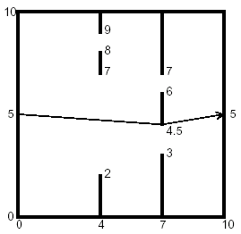

## 문제

You are to find the length of the shortest path through a chamber containing obstructing walls. The chamber will always have sides at x = 0, x = 10, y = 0, and y = 10. The initial and final points of the path are always (0,5) and (10,5). There will also be from 0 to 18 vertical walls inside the chamber, each with two doorways. The finger below illustrates such a chamber and also shows the path of minimal length.



## 입력

The input data for the illustrated chamber would appear as follows.

```

2
4 2 7 8 9
7 3 4 5 6 7
```

The first line contains the number of interior walls. Then there is a line for each such wall, containing five real numbers, The first number is the x coordinate of the wall (0 < x < 10), and the remaining four are the y coordinates of the ends if the doorways in that wall. The x coordinates of the walls are in increasing order and within each line the y coordinates are in increasing order. The input file will contain at least one such set of data. The end of the data comes when the number of walls is -1.

## 출력

The output file should contain one line of output for each chamber. The line should contain the minimal path length rounded to two decimal places past the decimal point, and always showing the two decimal places past the decimal point. The line should contain no blanks.,
