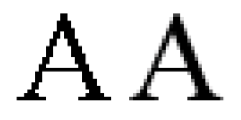

## 문제

Forays into Anti-Aliased Ascii Art

Aliasing is the term used for artifacts introduced when digitally sampling an analog source due to the finite resolution of the digital capture. Aliasing is a common problem in computer graphics, where lines and smooth curves appear jagged when plotted as pixels. For example, given an equation of a line to be plotted:

y=mx+b

a naive attempt to draw this line might result in something like

```

        *** 
      **
   ***
***
```

looking more like a staircase than a smooth line.



Aliasing (a.k.a. jaggies) can be countered by anti-aliasing schemes in which pixels are drawn in varying shades of gray and, sometimes, diffused over neighboring pixels to yield a smoother-looking image when viewed from sufficient distance, as illustrated by the picture at the top of this page.

One scheme for anti-aliasing lines works on the idea of shading two pixels at a time for each value for each x. Given a point (x, y) where y = mx + b, let yw be the “whole part” of y (the largest integer that is less than or equal to y) and let yf be the “fractional part” of y such that

yw + yf = y

For example, if y=23.56, then yw =23 and yf =0.56. Also,if y=−1.3,then yw =−2 and yf = 0.7.

Let the gray level of a pixel be a number from 0.0 to 1.0 where 0.0 denotes a pure white pixel and 1.0 denotes a pure black pixel. If yf is zero, then shade the pixel (x,yw) at a gray level of 1.0. If yf is non-zero, then shade the pixel (x, yw) at a gray level of 1 − yf and shade the pixel (x, yw + 1) at a gray level of yf .

Write a program to draw anti-aliased lines according to this scheme.

## 입력

The input set will consist of several cases. Each case is given as a single line, containing two numbers, m and b, denoting the slope and intercept of the line in the formula

y = mx + b

These numbers will be presented as floating point numbers with no more than 2 digits after the decimal point. m will be in the range 0.00 to 0.50 inclusive and b will be in the range -20.00 to 20.00 inclusive.

A zero value for both m and b signals the end of input and is not plotted.

## 출력

For each line in the input, produce a separate plot consisting of a 20 × 20 square of characters. Each character represents a point on the portion of the Cartesian plane defined by 0 ≤ x < 20, 0 ≤ y < 20. Each character position unrelated to the line is filled with a blank. The line is plotted by filling the appropriate character positions with a character obtained by computing the appropriate gray level as described above, rounding to the closest tenth, and then selecting a character from the following table:

|  |  |  |  |  |  |  |  |  |  |  |  |
| --- | --- | --- | --- | --- | --- | --- | --- | --- | --- | --- | --- |
| Rounded gray scale: | 0.0 | 0.1 | 0.2 | 0.3 | 0.4 | 0.5 | 0.6 | 0.7 | 0.8 | 0.9 | 1.0 |
| Character: | . | : | - | = | + | t | w | \* | # | % | @ |

The characters, if you have difficulty recognizing them, are: period, colon, hyphen, equals, plus, lower-case T, lower-case W, asterisk, hash, percent, at. yf and the gray level must be computed exactly. When rounding the gray level to the closest tenth, break ties by rounding up.

Each line of the plot will be printed as 20 characters, immediately preceded and immediately followed by a vertical bar (‘|’).

After each plot, print a single line containing 22 underscore (‘\_’) characters.
