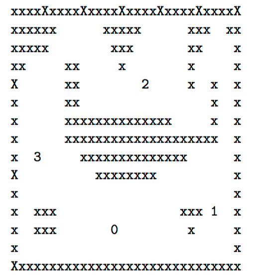
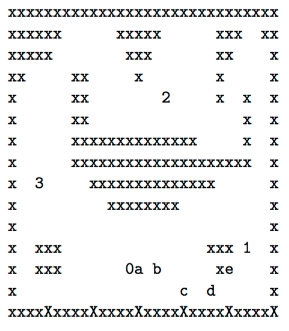

## 문제

Consider a race track laid out on a rectangular grid, like this:

An ‘x’ or ‘X’ denotes a wall or barrier of some kind. Each numeric digit indicates a checkpoint. A motorcycle starts at checkpoint ‘0’ and must visit each numbered checkpoint in order, ending the course at the highest-numbered checkpoint.

Movement of the motorcycle is constrained as follows: In the first second, the motorcycle must move to one of the 8 neighbors of its starting position. Each second after that, the motorcycle may move to a point P offset by the same horizontal and vertical distance by which the motorcycle moved in the previous second, or it may move to any of the eight neighbors of that point P. The motorcycle may not, however, land outside the grid or on an ‘x’ or ‘X’. It may, however, leap over one or more x’s or X’s as long as it lands in an empty square or at a checkpoint.

For example, in the layout above, the rider might move according to the sequence shown as ‘a’, ‘b’, ‘c’, ... as shown below:

and then on to the first checkpoint in 6 seconds.

Write a program to find the shortest time required to start at ‘0’ and end at the final checkpoint, landing upon each intervening checkpoint in the order indicated by the digits. The motorcycle may land on a checkpoint out of order while on its way to another checkpoint, but does not receive credit for having visited that checkpoint unless it has already visited all of the lower-numbered checkpoints.

## 입력

Input consists of multiple race courses. Each course begins with a line containing two integers, w, and h, denoting the width and height of the track. You are guaranteed that 1 ≤ w ≤ 40 and 1 ≤ h ≤ 40. A zero value for w and h denoted the end of the input.

This is followed by h lines, each line containing w characters. These define the race track as explained above. Each track will have an area of at least 2 and will contain at least two checkpoints (‘0’ and ‘1’) and no more than 10 checkpoints. Where more than two checkpoints are presented, the checkpoints will be in strict sequence — there will be no “gaps” in the numbering.

## 출력

Print the minimum # of seconds required to complete each course as an integer, one per line. If it is not possible to complete a course, print ‘-1’ instead.
