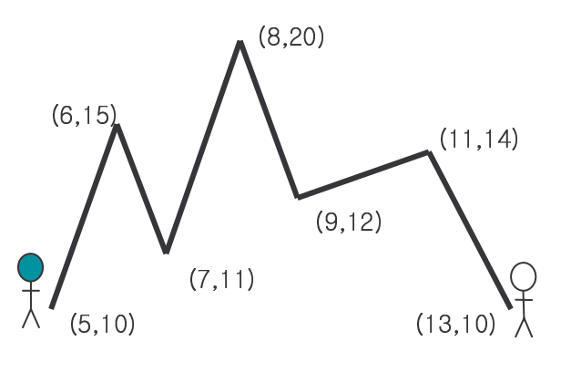
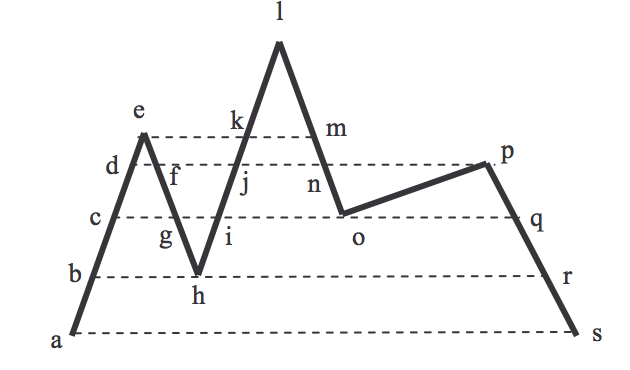

## 문제

Two mountain climbers are located at opposite ends of a mountain range, at the same elevation. The two climbers want to walk along the mountain range and reach each other’s starting place, while always staying at the same elevation. The climbers may move forward or backward to assure that they stay at the same elevation. It is well known that it is always possible for the two climbers to reach each other’s starting place if the mountain range never drops below the starting elevation. Given a mountain range, compute the minimum sum of the two walk lengths of the two climbers to reach each other’s starting place from their own starting place.

Mountain range is represented as a polygonal line P = (p1, p2, …, pn) in the plane with point set{pi = (xi, yi) : i = 1,…,n} and edge set {(pi, pi+1) : i=1, …, n-1}. The polygonal line P modeling a mountain range is monotone with respect to the x-coordinate axis, i.e.xi < xi+1 for i = 1,, n −1(see the following figure).

A walk of a climber along a mountain range P is a sequence W = (w1, w2, …, wm) of points wj ∈ P such that every line-segment of a walk must be on P , i.e., (wj,wj+1) ⊂ P for j = 1,,m −1. We compute the length of a walk along a line-segment (wj,wj+1) of W as the difference of the y-coordinates of wj and wj+1, i.e., the distance is |yi - yi-1| where yi(yi+1) is the y-coordinate of wi(wi+1), respectively. The length of a walk W is the sum of the lengths of the line-segments of W.

For example, in the above figure, the walk of the left climber is (a, d, c, e, g, f, h, j, i, l, o, p, r, p, o, m, o, p, s), and the sum of walk lengths for the two climbers is 120. We can see that the length is the shortest length of walks by the climbers.

## 입력

The input consists of T test cases. The number of test cases T (1 ≤ T ≤ 3) is given in the first line of the input file. The first line of each test case contains an integer n (3 ≤ n ≤ 1000), which is the number of points in a polygonal line P representing a mountain range. In the following n lines, coordinates of points in P come in the order of p1, p2, …, pn. Each line contains two integers nx and ny (0 ≤ nx, ny ≤ 10000), where nx is the x-coordinate and ny is the y-coordinate of a point of P. One mountain climber starts at p1, and the other starts at pn. Therefore, the y-coordinates of p1 and pn must be the same. You may assume that for each input test case, the mountain range never drops below the starting elevation and the y-coordinate of pi,1≤ i ≤ n, is unique.

## 출력

For each test case, your program reports, on each line, the minimum length of walks by the two climbers.

The following sample input and corresponding correct output represents three test cases.
