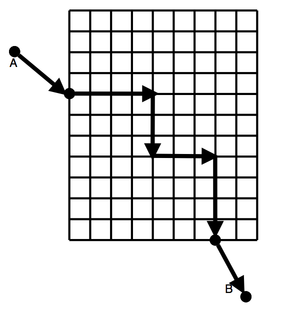

## 문제

The streets in Manhattan form a grid. If the grid is aligned such that the grid lines are parallel to the x- and y-coordinate axes, the distance one needs to walk or drive from one point to the other, assuming you can only move along streets and cannot take short cuts through buildings, equals ∆x + ∆y. This is called the Manhattan distance.

Now assume that the land outside the city grid is completely flat with no obstacles that prevent moving anywhere. Suppose we want to move from point A to point B where these points can be on the grid or outside the grid. When traveling outside the city, the shortest distance between the two points in this case will not necessarily be the Manhattan distance. It will be the Manhattan distance if the two points are both on the grid. If both points are, for example, north of the grid, the shortest distance between the two points will be the straight-line (Euclidean) distance between them. In other cases, calculating the distance may be more complicated.

In this problem, two opposite corners of the city grid will be specified. It will be assumed that the grid lines are parallel to the coordinate axes, and that the distance between any two consecutive grid lines, horizontal and vertical, is 1 unit. Two points A and B on the plane with integer coordinates will also be specified. Write a program to calculate the shortest distance between the two points, given that we can only move along the grid lines (i.e. in the city streets) within the city grid.

## 입력

Input will consist of multiple datasets. Each dataset will consist of a single line with eight integers, as follows:

xL yL xU yU xA yA xB yB

describing the points L, U, A, and B. L and U are the lower-left corner and the upper-right corner of the city grid, respectively. A and B are the two points between which we wish to travel.

All input integers will be in the range from -1000 to 1000 (inclusive), with xL < xu and yL < yU . End of data will be signified by a line with eight zeros.

## 출력

For each data set, print one line containing the distance of the shortest path between the A and B, printed to to three decimal places of precision.
