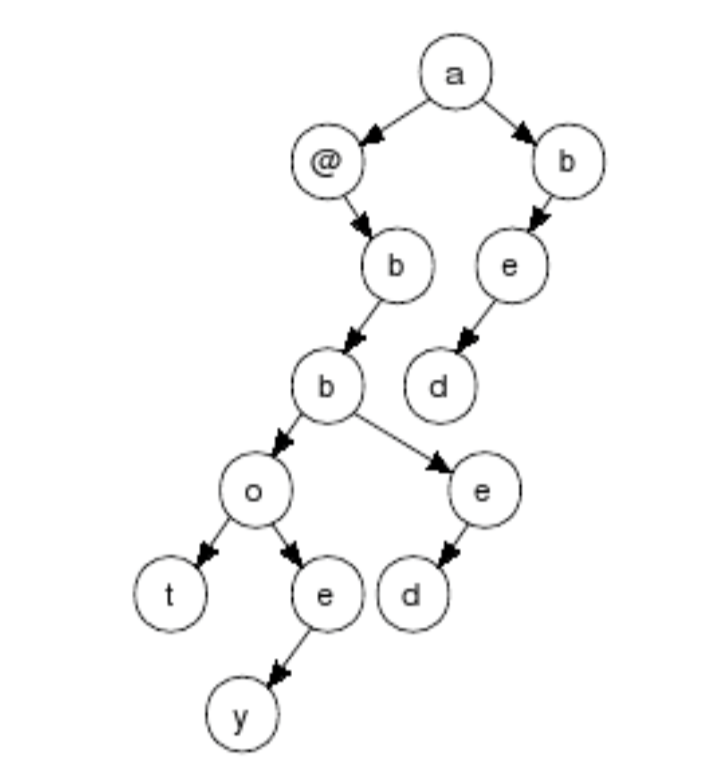

## 문제

Spark Plug Searching, Ltd., is looking to enter the market of web-based applications with a new word processor. The team implementing the spell checker have proposed storing the dictionary in a binary-encoded trie, a binary tree structure in which words are located by moving down the tree, one letter at a time, but discarding any letter from which one takes a right branch.

The end of a word is indicated whenever a letter has no left child or by an @ character. This trie (in the diagram) contains the words a, abbot, abbey, abed, and bed.

Some team members have objected that the resulting data structure will be too large for practical use. Others have argued that the size can be dramatically reduced by taking advantage of the fact that many words end in common suffixes. The trie can be scanned for common subtrees and the parents of identical subtrees could be altered so that they all point to a single instance of that subtree. Your job is to demonstrate this process. Write a program to find the shared subtree that would produce the maximum reduction in the number of nodes if all instances of that subtree were replaced by a single shared instance.

## 입력

Input consists of one or more lines, each line describing one tree. Each tree is presented, left justified, in preorder form using at least one and up to 200 characters. The nodes of the tree are denoted by a single lowercase letter or `@'. The character `#' indicates that a node does not have a child in the indicated position. Note that with these conventions, the tree described by the preorder traversal will be unique.

End of input is indicated by a line consisting of the word ``END".

## 출력

For each input tree, print the non-empty subtree (in the same format) that yields the greatest savings if all instances are replaced by a single shared instance. Then, on the same line, print a space and then the number of nodes that would be saved by this replacement. Print no blank lines between outputs.

If there is a tie among different subtrees that could yield maximal savings, select the smallest tree from among those tied. If there remains more than one candidate, select the one occurring first in a preorder traversal of the original tree.
