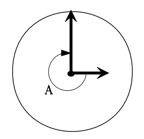

## 문제

You recently installed a stylish clock in your office that is perfectly round and has no markings that identify its orientation. After accidentally bumping it, you realized that 12 o’clock might no longer be at the top. Nonetheless, you want to figure out what time it is. Fortunately you recently overheard a coworker giving the time and you have a protractor and can measure the angle between the hour and minute hands.

Your program should print the first time that has the correct angle be-  
tween the hour and minute hands and that is on or after the overheard time. The angle (0 to 359 degrees, inclusive) will be measured clockwise from the hour hand to the minute hand. Assume that the clock hands move smoothly.

## 입력

Input will consist of one test case per line, of the form

A HH:MM:SS

where A is the integral number of degrees that must be traversed clockwise to get from the hour hand to the minute hand and HH : MM : SS is the overheard time in 24 hour form. 0 ≤ A ≤ 359, 0 ≤ HH ≤ 23, 0 ≤ MM ≤ 59, and 0 ≤ SS ≤ 59. HH, MM, and SS will be exactly two digits with a leading zero if necessary.

End of input will be signaled by the line

-1 00:00:00

## 출력

Output will consist of one line per test case, of the form

HH:MM:SS

where HH : MM : SS is the first time on or after the input time where the angle from the hour hand to the minute hand is exactly A degrees, rounded down to the nearest second. HH, MM, and SS should be zero padded to two digits and in the same range as the input (0...23, 0...59, and 0 . . . 59 respectively).
