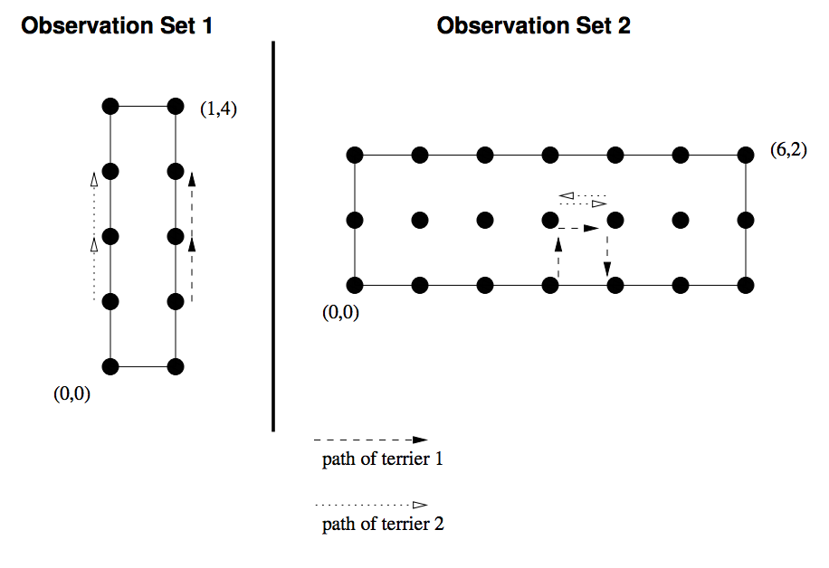

## 문제

A mole has pockmarked our yard with a rectangular grid of tunnels. Infuriated at the damage, we have released a number of terriers into the yard to catch the mole. The terriers have very sensitive hearing and, if they come close enough to the mole, can dig very quickly and catch the rodent. Unfortunately, the mole is very sensitive to the vibrations caused by the footsteps of the terriers, and will actively try to evade them.

We have no idea where the mole was when the terriers were released. But we have watched the terriers move about the yard for some time, and the mole has not been caught. Write a program that deduces where the mole might be, given our observations.

At the time we began recording our observations, we also know that the mole was not in a position underneath or adjacent to a terrier. In each subsequent time interval, the terriers may have remained in the same position or may have moved one space horizontally or vertically. Then the mole may have done the same. If, before or after any of these moves, by terriers or by the mole, a terrier were directly over the mole or in a position adjacent (horizontally or vertically) to the mole, the mole would have been caught.

Write a program that accepts a description of the yard and of the location of the terriers within it over a period of time. The program should print a list of the possible positions of the mole at the end of that time.

## 입력

The input for this program consists of one or more observation sets. Each observation set is constructed as follows:

* The first line contains 4 integers  
  <W> <L> <N> <T>   
  W and L are positive integers representing the width (x dimension) and length (y dimension) of the yard. N is the non-negative number of terriers. T is the positive number of time intervals over which we have conducted observations.
* The remainder of the observation set contains one line per terrier. Each line contains 2T integers denoting the (x,y) coordinates of the terrier at each of the T time steps, expressed separated by whitespace without parentheses or commas. Possible coordinates range from (0, 0) in one corner of the yard to (W, L) at the opposite corner.

The end of input is signaled by a line containing 4 zeros in place of a valid (W, L, N, T ) set.

## 출력

For each observation set, your program should print a line ”Observation Set ” followed by the integer number of the set (starting at 1).

If there is at least one possible location for the mole, then, beginning on the next line, print all the possible locations of the mole as (x, y) pairs, 8 pairs per output line (except possibly fewer for the final line of output for the set). There should be no leading blanks before the first pair on a line nor trailing blanks after the final pair on the line, but successive pairs on the same line should be separated by exactly one blank. A pair is printed in the format “(x, y)” with no internal blanks. Pairs should be printed in an order such that pairs with lower values of y come before any pairs with higher values of y and, for pairs with the same y value, pairs with lower values of x come before pairs with higher values of x.

If there are no possible locations for the mole, then the second line of output for the observation set will consist of the message “No possible locations”.

## 힌트

This input set may be visualized as:

