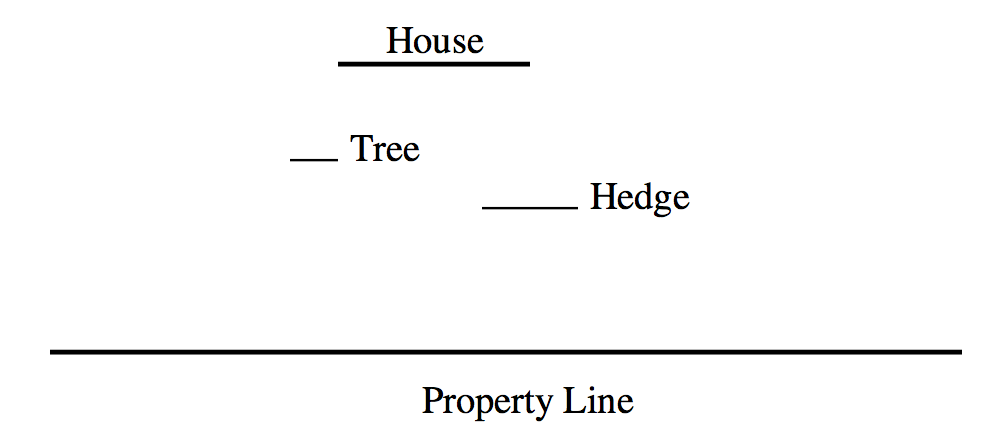

## 문제

An architect is very proud of his new home and wants to be sure it can be seen by people passing by his property line along the street. The property contains various trees, shrubs, hedges, and other obstructions that may block the view. For the purpose of this problem, model the house, property line, and obstructions as straight lines parallel to the x axis:

To satisfy the architect’s need to know how visible the house is, you must write a program that accepts as input the locations of the house, property line, and surrounding obstructions and calculates the longest continuous portion of the property line from which the entire house can be seen, with no part blocked by any obstruction.

## 입력

Because each object is a line, it is represented in the input file with a left and right x coordinate followed by a single y coordinate:

<x1> <x2> <y>

Where x1, x2, and y are non-negative real numbers. x1 < x2

An input file can describe the architecture and landscape of multiple houses. For each house,  
the first line will have the coordinates of the house. The second line will contain the coordinates of the property line. The third line will have a single integer that represents the number of obstructions, and the following lines will have the coordinates of the obstructions, one per line.

Following the final house, a line “0 0 0” will end the file.

For each house, the house will be above the property line (house y > property line y). No obstruction will overlap with the house or property line, e.g. if obstacle y = house y, you are guaranteed the entire range obstacle[x1, x2] does not intersect with house[x1, x2].

## 출력

For each house, your program should print a line containing the length of the longest continuous segment of the property line from which the entire house can be to a precision of 2 decimal places. If there is no section of the property line where the entire house can be seen, print “No View”.
