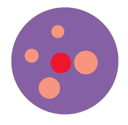

## 문제

In circle land, in the museum of circles, a grand red circular gem is on display.

The curator has decided to spice up the display, and has placed the gem on a purple circular platform, along with mundane orange circular gems.

Starved citizens of circle land (points) have flocked to see the grand exhibit of the exquisite red gem. They cannot step on the purple exhibit floor, but can only stand on the circumference. Unfortunately, the mundane orange gems block the view of the exquisite red gem. Please help the museum folks determine the proportion of the circumference of the purple platform from which all of the red gem is visible, completely unobstructed by the orange gems.

## 입력

There will be several test cases in the input. Each test case will begin with a line with five integers:

```

n p x y r
```

Where n (1≤n≤100) is the number of orange circles, p (10≤p≤1,000) is the radius of the purple platform, (x,y) is the center of the red gem relative to the center of the purple platform (-1,000≤x,y≤1000), and r (0<r≤1000) is the radius of the red gem. The red gem is guaranteed to lie fully on the purple platform. No part of the red gem will extend past the purple platform. On each of the next n lines will be three integers:

```

x y r
```

which represent the (x,y) center (-1,000≤x,y≤1000) relative to the center of the purple platform, and radius r (0<r≤1000) of each orange gem. As with the red gem, each orange gem is guaranteed to lie entirely on the purple platform. The orange gems will not overlap the red gem, and they will not overlap each other. The input will end with a line with 5 0s.

## 출력

For each test case, output a single floating point number on its own line, indicating the proportion of the perimeter of the purple platform where all of the red gem is visible. This result should be between 0 and 1 (inclusive). Output this number with exactly 4 decimal places of accuracy, with standard 5 up / 4 down rounding (e.g. 2.12344 rounds to 2.1234, 2.12345 rounds to 2.1235). Output each number on its own line, with no spaces, and do not print any blank lines between answers.
