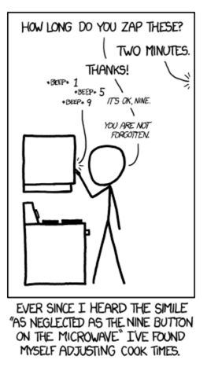

## 문제

Randall Munroe from xkcd.com pointed out that 9 is the most rarely used key on a microwave. Let's all share the load.

Given a desired cooking time, find a sequence of keys with the greatest number of 9's such that the resulting time has less than 10% error compared to the desired cooking time. In other words, if T is the desired cooking time in seconds, and T9 is the cooking time specified by the found sequence, then 10|T - T9| < T. If there are multiple possibilities, choose the one that has the smallest error (in magnitude). If there are still ties, choose the one that is lexicographically smallest.

For example, for T = 01:15, the times 00:68-00:82 and 1:08-1:22 have less than 10% error. Of these, 00:69, 00:79, 01:09, and 01:19 have the greatest number of 9's, and the ones with the smallest error are 00:79 and 01:19. The lexicographically smaller of these is 00:79.

## 입력

The input consists of a number of cases. For each case, the desired cooking time in MM:SS format is specified on one line. Each M or S can be any digit from 0 to 9. The end of input is indicated by 00:00.

## 출력

For each case, output on a single line the four keys to use as input to the microwave, in MM:SS format.
