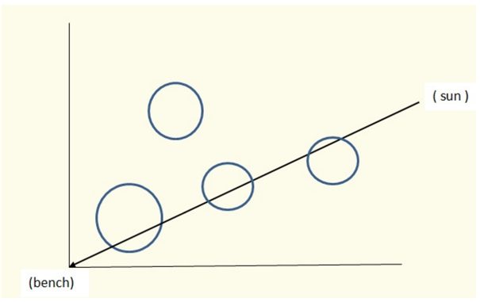

## 문제

It is always sunny in Flatland. This tends to get annoying so Alex is heading to a park trying to catch some shade.

The park is a square with sides of 400 units centered at the origin of the Cartesian plane (vertices at (±200,±200)). There is a point-sized bench in the center of the park (at the origin) and the Sun is another point traveling clockwise along the circle centered at origin and with a radius of 500 units. At midnight the Sun is at the point (0,500) and it takes 24 hours for it to complete the full revolution.

There are several trees in the park that can provide shade for Alex. Trees are modeled as solid circles with integer coordinates and radii. The 'shade value' at any particular time is defined as the sum of the lengths of the chords created by the intersections of a ray of sunlight with trees. (The sum of the lengths of the chords is a measure of how much 'leaves and branches' the ray of light would have to pass through.) This is illustrated in the diagram, in which trees are solid circles but only the boundaries are drawn to show the chords.

We compute the shade value every minute, on the minute over a 24-hour period, starting at midnight: at 00:00, 00:01, ..., 23:59. We would like to determine the maximum of these shade values.

## 입력

There are number of test cases (at most 100), each starting with a line with integer N, 1≤N≤200, the number of trees. Next follow N lines each containing three integers xi, yi, ri

- coordinates of the center and the value of the radius of ith tree. The last case is followed by a line containing a single 0.

No tree contains or intersects (but may touch) another one nor does it go outside the edge of the park. No tree contains or touches the bench.

## 출력

For each test case, print on a single line the maximum of the computed shade values, displayed to 3 decimal places. An output value is acceptable if it is within 0.001 of the correct value,
