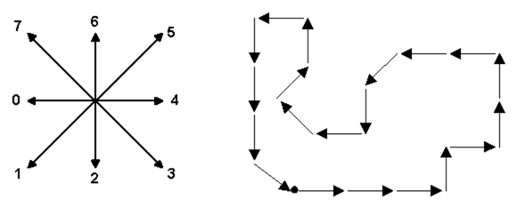

## 문제

In computer vision, a chain code is a sequence of numbers representing directions when following the contour of an object. For example, the following figure shows the contour represented by the chain code 22234446466001207560 (starting at the upper-left corner).



Two chain codes may represent the same shape if the shape has been rotated, or if a different starting point is chosen for the contour. To normalize the code for rotation, we can compute the first difference of the chain code instead. The first difference is obtained by counting the number of direction changes in counterclockwise direction between consecutive elements in the chain code (the last element is consecutive with the first one). In the above code, the first difference is

```

00110026202011676122
```

Finally, to normalize for the starting point, we consider all cyclic rotations of the first difference and choose among them the lexicographically smallest such code. The resulting code is called the shape number.

```

00110026202011676122
01100262020116761220
11002620201167612200
...
20011002620201167612
```

In this case, 00110026202011676122 is the shape number of the shape above.

## 입력

The input consists of a number of cases. The input of each case is given in one line, consisting of a chain code of a shape. The length of the chain code is at most 300,000, and all digits in the code are between 0 and 7 inclusive. The contour may intersect itself and needs not trace back to the starting point.

## 출력

For each case, print the resulting shape number after the normalizations discussed above are performed.
