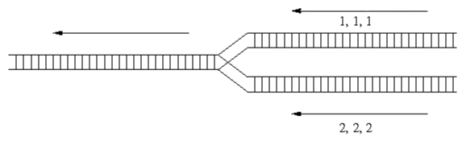

## 문제

A train yard is a complex series of railroad tracks for storing, sorting, or loading/unloading railroad cars. In this problem, the railroad tracks are much simpler, and we are only interested in combining two trains into one.

Figure 1: Merging railroad tracks.

The two trains each contain some railroad cars. Each railroad car contains a single type of products identified by a positive integer up to 1,000,000. The two trains come in from the right on separate tracks, as in the diagram above. To combine the two trains, we may choose to take the railroad car at the front of either train and attach it to the back of the train being formed on the left. Of course, if we have already moved all the railroad cars from one train, then all remaining cars from the other train will be moved to the left one at a time. All railroad cars must be moved to the left eventually. Depending on which train on the right is selected at each step, we will obtain different arrangements for the departing train on the left. For example, we may obtain the order 1,1,1,2,2,2 by always choosing the top train until all of its cars have been moved. We may also obtain the order 2,1,2,1,2,1 by alternately choosing railroad cars from the two trains.

To facilitate further processing at the other train yards later on in the trip (and also at the destination), the supervisor at the train yard has been given an ordering of the products desired for the departing train. In this problem, you must decide whether it is possible to obtain the desired ordering, given the orders of the products for the two trains arriving at the train yard.

## 입력

The input consists of a number of cases. The first line contains two positive integers N1 N2 which are the number of railroad cars in each train. There are at least 1 and at most 1000 railroad cars in each train. The second line contains N1 positive integers (up to 1,000,000) identifying the products on the first train from front of the train to the back of the train. The third line contains N2 positive integers identifying the products on the second train (same format as above). Finally, the fourth line contains N1+N2 positive integers giving the desired order for the departing train (same format as above).

The end of input is indicated by N1 = N2 = 0.

## 출력

For each case, print on a line possible if it is possible to produce the desired order, or not possible if not.
