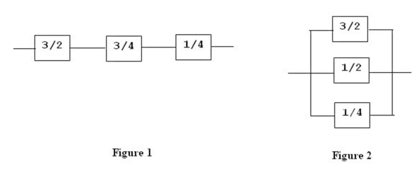
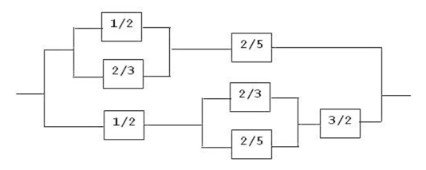

## 문제

Every electrical appliance (such as a light bulb) has a certain resistance. If the appliance is connected to a given voltage, the higher its resistance, the lower the current flowing through the appliance. The unit of measurement for resistance is the ohm. In order to avoid round-off errors that can affect floating-point numbers, we will use rational numbers (quotients of positive integers) to represent the resistance of an appliance numerically.

There are two basic ways to connect two or more appliances into a configuration of appliances: serially (Figure 1) or parallel (Figure 2).

Two or more configurations can be further connected serially or parallel to yield another (more complex) configuration yet, and this process of building more complex configurations from existing ones can be repeated any number of times (Figure 3).

In general, a configuration is either a single appliance, or a serial connection of two or more configurations, or a parallel connection of two or more configurations.

The resistance of a configuration of resistors can be computed according to the following two rules:

1. The resistance of a serial configuration is the sum of the resistances of its component configurations.
2. The resistance of a parallel configuration is the reciprocal of the sum of the reciprocals of its component configurations.



In Figure 1, the resistance of the configuration is 3/2 + 3/4 + 1/4 = 5/2 ohm.

In Figure 2, the resistance of the configuration is 1/(1/(3/2) + 1/(1/2) + 1/ (1/4)) = 3/20 ohm



In Figure 3, we first calculate 1/(1/(1/2) + 1/(2/3)) + 2/5 = 24/35 and 1/2 + 1/(1/(2/3) + 1/(2/5)) + 3/2 = 9/4. Adding the reciprocals of these two values and reciprocating the result, we get 72/137 ohm.

A configuration can be represented in text format.

* A single appliance is represented by the numerical value of its resistance (without enclosing parentheses).
* A configuration that is the serial connection of several configurations is represented as a list of the representations of its components, separated by the ampersand character ("&") and enclosed in a pair of parentheses.
* A configuration that is the parallel connection of several configurations is represented as a list of the representations of its components, separated by the vertical bar character ("|") and enclosed in a pair of parentheses.

Thus, figures 1, 2, and 3 are represented in text format by the respective expressions:

```

(3/2 & 3/4 & 1/4)
(3/2 | 1/2 | 1/4)
(((1/2 | 2/3) & 2/5) | (1/2 & (2/3 | 2/5) & 3/2))
```

## 입력

The input consists of a number of test cases, one test case per line. Each line of the input contains a valid expression that defines a configuration according to the rules stated above. The resistance values of the appliances will be positive rational numbers, in the form NUMERATOR/DENOMINATOR. There will be one blank space on each side of every ampersand or vertical bar. There will be no other blank spaces in the expression.

## 출력

For each test case, print the resistance of the configuration on a new line, in the form NUMERATOR/DENOMINATOR, with all common factors of NUMERATOR and DENOMINATOR cancelled. Do not print any blank spaces.
