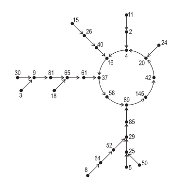
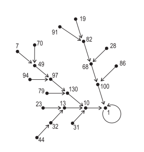

## 문제

양의 정수를 하나 고른 뒤, 각 자리수의 제곱의 합을 구한다. 이것을 계속 반복하면, 흥미로운 특징을 가지는 무한 수열을 얻을 수 있다.

가장 처음에 5로 시작했을 때, 다음과 같은 수열을 얻을 수 있다.

5, 25, 29, 85, 89, 145, 42, 20, 4, 16, 37, 58, ...

여기서 가장 흥미로운 특징은 58다음에 나타난다. 52 + 82 = 89로 이 숫자는 이미 수열에 나왔단 수이다. 즉, 58 다음부터 수열은 다음과 같은 구간이 반복해서 나온다. 89, 145, 42, 20, 4, 16, 37, 58

위의 사이클은 다른 숫자로 시작해도 나타나는 사이클이다. (3, 18, 36, 64, 등등등)

어떤 숫자는 1로 반복되는 사이클이 나타나기도 한다. 예를 들어 19로 시작했을 때를 살펴보자.

19, 82, 68, 100, 1, ...

두 숫자가 주어졌을 때, 같은 수가 나올 때 까지 필요한 수열의 길이의 합의 최솟값을 구하는 프로그램을 작성하시오.

예를 들어, 61과 29로 시작하면, (61, 37, 58, **89**)와 (29, 85, **89**)에서 같은 수를 만들 수 있다. 19와 100으로 시작하는 경우에는 (19, 82, 68, **100**), (**100**)으로 같은 수를 만들 수 있다.

## 입력

입력을 여러 개의 테스트 케이스로 이루어져 있다. 각 테스트 케이스는 한 줄로 이루어져 있고, A와 B가 주어진다. (0 < A, B < 109)

마지막 줄에는 0이 두 개 주어진다.

## 출력

각 테스트 케이스에 대해서, A와 B를 출력하고, 두 수열의 길이의 합의 최솟값을 출력한다. 만약, 두 수열에서 같은 수가 나타나지 않는다면, 0을 출력한다.

## 힌트

89, 145, 42, 20, 4, 16, 37, 58 사이클

1 사이클

