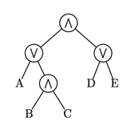

## 문제

모든 불리언 식은 Disjunctive Normal Form(DNF)나 Conjunctive Normal Form(CNF)로 나타낼 수 있다. DNF는 하나 또는 그 이상의 CNF식을 OR로 연결한 식이고, CNF는 DNF식을 AND로 연결한 식이다.

AND/OR 트리는 DNF나 CNF 불리언 식을 트리와 같은 형태로 표현한 것이다. DNF나 CNF는 서로를 부분식으로 포함하기 때문에, 서브 트리의 레벨만 알면 그 서브 트리가 AND트리인지 OR트리인지를 알 수 있다.

오른쪽 그림은 (A∨(B∧C))∧(D∨E)를 트리로 나타낸 것이다. 레벨 1(가장 위)과 3은 AND트리이다.

AND/OR 트리가 주어졌을 때, 식을 계산하는 프로그램을 작성하시오.

## 입력

입력은 여러 개의 테스트 케이스로 이루어져 있다. 각 테스트 케이스는 한 줄로 이루어져 있고, 32,000글자를 넘지 않는다.

```

(E1 E2 ... En)
```

항상 n > 0을 만족하고, Ei가 T인 경우에는 true, F인 경우에는 false이다. 부분식도 이와 같은 형식으로 주어진다.

가장 낮은 레벨에 있는 트리는 AND 트리이다. 입력의 마지막 줄에는 ()가 주어진다.

## 출력

각 테스트 케이스에 대해서, 다음을 출력한다.

```

k. E
```

k는 테스트 케이스의 번호이고, E는 입력으로 주어진 식의 값 true 또는 false이다.
