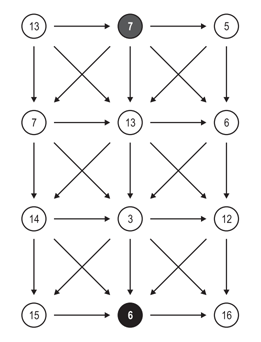

## 문제

이 문제는 삼각 그래프의 가장 위쪽 가운데 정점에서 가장 아래쪽 가운데 정점으로 가는 최단 경로를 찾는 문제이다.

삼각 그래프는 사이클이 없는 그래프로 N ≥ 2 개의 행과 3열로 이루어져 있다. 삼각 그래프는 보통 그래프와 다르게 간선이 아닌 정점에 비용이 있다. 어떤 경로의 비용은 그 경로에서 지나간 정점의 비용의 합이다.

오른쪽 그림은 N = 4인 삼각 그래프이고, 가장 위쪽 가운데 정점에서 가장 아래쪽 가운데 정점으로 경로 중 아래로만 가는 경로의 비용은 7+13+3+6 = 29가 된다. 삼각 그래프의 간선은 항상 오른쪽 그림과 같은 형태로 연결되어 있다.

## 입력

입력은 여러 개의 테스트 케이스로 이루어져 있다. 각 테스트 케이스의 첫째 줄에는 그래프의 행의 개수 N이 주어진다. (2 ≤ N ≤ 100,000) 다음 N개 줄에는 그래프의 i번째 행에 있는 정점의 비용이 순서대로 주어진다. 비용은 정수이며, 비용의 제곱은 1,000,000보다 작다.

입력의 마지막 줄에는 0이 하나 주어진다.

## 출력

각 테스트 케이스에 대해서, 가장 위쪽 가운데 정점에서 가장 아래쪽 가운데 정점으로 가는 최소 비용을 테스트 케이스 번호와 아래와 같은 형식으로 출력한다.

```

k. n
```

k는 테스트 케이스 번호, n은 최소 비용이다.
