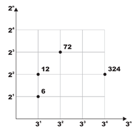
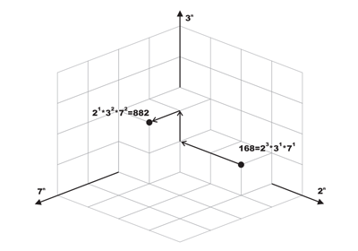

## 문제

Any positive integer v can be written as p1a1 ∗ p2a2 ∗ . . . ∗ pnan where pi is a prime number and ai ≥ 0. For example: 24 = 23 ∗ 31.

Pick any two prime numbers p1 and p2 where p1 ≠ p2. Imagine a two dimensional plane where the powers of p1 are plotted on the x-axis and the powers of p2 on the yaxis. Now any number that can be written as p1a1 ∗ p2a2 can be plotted on this plane at location (x, y) = (a1, a2). The figure on the right shows few examples where p1 = 3 and p2 = 2.

This idea can be extended for any N-Dimensional space where each of the N axes is assigned a unique prime number. Each N-Dimensional space has a unique set of primes.

We call such set the Space Identification Set or S for short. |S| (the ordinal of S) is N.

Any number that can be expressed as a multiplication of pi ∈ S (each raised to a power (ai ≥ 0) can be plotted in this |S|-Dimensional space. The figure at the bottom illustrates this idea for N = 3 and S = {2, 3, 7}. Needless to say, any number that can be plotted on space A can also be plotted on space B as long as SA ⊂ SB.

We define the distance between any two points in a given N-Dimensional space to be the sum of units traveled to get from one point to the other while following the grid lines (i.e. movement is always parallel to one of the axes.) For example, in the figure below, the distance between 168 and 882 is 4.

Given two positive integers, write a program that determines the minimum ordinal of a space where both numbers can be plotted in. The program also determines the distance between these two integers in that space.



## 입력

Your program will be tested on one or more test cases. Each test case is specified on a line with two positive integers (0 < A, B < 1, 000, 000) where A ∗ B > 1. The last line is made of two zeros.

## 출력

For each test case, print the following line:

```

k. X:D
```

Where k is the test case number (starting at one,) X is the minimum ordinal needed in a space that both A and B can be plotted in. D is the distance between these two points.
