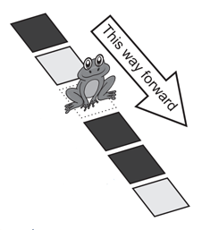

## 문제

Kermit The Frog is a classic video game with a simple control and objective but requires a good deal of thinking. You control an animated frog that can walk and hop, in both forward and backward directions. The frog stands in a space between an otherwise a contiguous line of tiles. Each tile is painted black on one side, and white on the other. The frog can walk (forward, or backward) over an adjacent tile (in front or behind him.) When the frog walks over a tile, the tile slides to the space where the frog was standing. For example, in the adjacent figure, the frog has two tiles behind him, and three in front. We’ll use the notation BWFBBW to refer to this situation where F refers to the space (where the frog is standing,) B is a tile with its black face showing, while W is a tile with its white face showing. The forward direction is from left to right. If the frog were to walk forward, the resulting situation is BWBFBW. Similar behavior when the frog walks backward, the tile behind the frog slides to where the frog was standing. The frog can also hop over the tiles. The frog can hop over an adjacent tile landing on the tile next to it. For example, if the frog was to hop backward, it would land on the first (left-most) tile, and the tile would jump to the space where the frog was standing. In addition, the tile would flip sides. For example, hopping backward in the figure would result in the situation: FWWBBW. We challenge you to write a program to determine the minimum number of moves (walks or hops) to transform one tile configuration into another.

## 입력

Your program will be tested on one or more test cases. Each test case is specified on a single line that specifies string S representing the initial tile arrangement. S is a non-empty string and no longer than 100 characters and is made of the letters ’B’, ’W’, and exactly one ’F’. The last line of the input file has one or more ’-’ (minus) characters.

## 출력

For each test case, print the following line:

```

k. M
```

Where k is the test case number (starting at one,) and M is the minimum number of moves needed to transform the given arrangement to an arrangement that has no white tile(s) between any of its black tiles . The frog can be anywhere. M is -1 if the problem cannot be solved in less than 10 moves.
