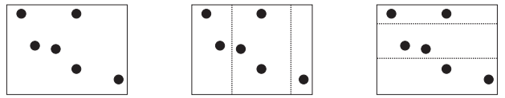

## 문제

창영제국의 황제 김상근이 세상을 떠났다. 사람들은 그가 가졌던 제국이 어떻게 자식들에게 나누어질 것인지 궁금해하기 시작했다. 제국은 직사각형 모양이고, N개의 도시가 있다.

땅은 K-1개의 선분으로 나누어야 한다. 선분은 지도의 축과 평행이어야 한다.

나누어진 지도에는 정확하게 K개의 직사각형이 있어야 하고, 모두 같은 높이(땅을 수직으로 나누었을 때)나 같은 너비(수평으로 나누었을 때)를 가지고 있어야 한다. 선분은 도시를 지나면 안 된다.

모든 상근이의 자식들은 K개의 나누어진 제국 하나를 임의로 받게 되고, 그 땅에 포함된 도시를 가질 수 있다.

모든 자식들에게 공평하게 땅을 나누어주기 위해서 각 자식들에게 N/K의 도시를 주려고 한다. 이 N/K를 기준값이라고 한다. 하지만, 기준값은 정수가 아닐수도 있기 때문에, 각각의 자식들은 최대한 기준값에 가깝게 도시를 얻기를 원한다.

각 자식의 불공평점수는 그 자식이 가진 도시의 수와 기준값과의 차이이다. 모든 자식의 불공평점수의 평균을 최소로 하려고 한다.

위의 예는 땅에 도시가 6개, 상근이의 자식이 3명 있을 때이다. (기준값 = 6/3 = 2.0) 왼쪽 그림은 제국의 지도이다. 가운데 그림처럼 나누었을 때, 가운데 영역에는 도시가 3개 있다. 이 땅을 받는 자식의 불공평점수는 |3-2| = 1이다. 왼쪽 영역은 2개의 도시가 있기 때문에 불공평점수는 0이고, 오른쪽 영역은 1개의 도시가 있기 때문에 불공평점수는 1이다. 따라서, 불공평점수의 평균은 2/3이 된다.

가장 오른쪽 그림은 모두 같은 수의 도시를 받게 되므로 불공평점수의 평균이 0이 된다.

땅과 도시의 위치가 주어졌을 때, 공평하게 땅을 나누어 불공평점수의 평균을 최소로 하는 프로그램을 작성하시오.

## 입력

입력은 여러 개의 테스트 케이스로 이루어져 있다. 각 테스트 케이스는 N+1줄로 이루어져 있다.

테스트 케이스의 첫째 줄에는 도시의 수 N(N ≤ 100,000)과 자식의 수 K(K ≤ 10)가 주어진다. 항상 K ≤ N이다.

다음 N개의 줄에는 도시의 좌표 (x,y)가 주어진다. (0 ≤ x,y ≤ 100,000) x와 y는 정수이다. 원래 지도에 있는 도시의 좌표를 가까운 정수로 반올림해서 나타낸 것이기 때문에, 같은 위치에 하나보다 많은 도시가 있을 수도 있다. 모든 좌표를 포함하는 가상의 직사각형이 지도의 경계라고 생각하면 된다.

나누는 선은 정수 좌표를 갖지 않아도 된다.

입력의 마지막 줄에는 0이 두 개 주어진다.

## 출력

각 테스트 케이스에 대해서, 테스트 케이스 번호와 불공평점수의 평균값의 최솟값을 출력한다. 불공평점수의 평균값은 A/B와 같은 형식으로 출력하고, 기약분수이어야 한다. 만약 평균이 정수일 경우에는 B=1로 출력해야 한다.
