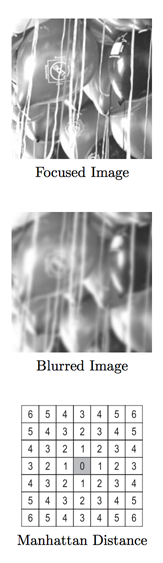

## 문제

Image blurring occurs when the object being captured is out of the camera’s focus. The top two figures on the right are an example of an image and its blurred version. Restoring the original image given only the blurred version is one of the most interesting topics in image processing. This process is called deblurring, which will be your task for this problem.

In this problem, all images are in grey-scale (no colours). Images are represented as a 2 dimensional matrix of real numbers, where each cell corresponds to the brightness of the corresponding pixel. Although not mathematically accurate, one way to describe a blurred image is through averaging all the pixels that are within (less than or equal to) a certain Manhattan distance† from each pixel (including the pixel itself ). Here’s an example of how to calculate the blurring of a 3x3 image with a blurring distance of 1:

\(\text{blur}\begin{pmatrix}\begin{bmatrix} 2 & 30 & 17 \\  25 & 7 & 13 \\ 14 & 0 & 35 \end{bmatrix}   \end{pmatrix} \\ = \begin{bmatrix} \frac{2+30+25}{3} & \frac{2+30+17+7}{4} & \frac{30+17+13}{3} \\ \frac{2+25+7+14}{4} & \frac{30+25+7+13+0}{5} & \frac{17+7+13+35}{4} \\ \frac{25+14+0}{3} & \frac{7+14+0+35}{4} & \frac{13+0+35}{3} \end{bmatrix} \\ = \begin{bmatrix} 19 & 14 & 20 \\ 12 & 15 & 18 \\ 13 & 14  & 16 \end{bmatrix}\)

Given the blurred version of an image, we are interested in reconstructing the original version assuming that the image was blurred as explained above.

†The Manhattan Distance (sometimes called the Taxicab distance) between two points is the sum of the (absolute) difference of their coordinates. The grid on the lower right illustrates the Manhattan distances from the grayed cell.

## 입력

Input consists of several test cases. Each case is specified on H + 1 lines. The first line specifies three non negative integers specifying the width W, the height H of the blurred image and the blurring distance D respectively where (1 ≤ W, H ≤ 10) and (D ≤ min(W/2, H/2)). The remaining H lines specify the gray-level of each pixel in the blurred image. Each line specifies W non-negative real numbers given up to the 2nd decimal place. The value of all the given real numbers will be less than 100.

Zero or more lines (made entirely of white spaces) may appear between cases. The last line of the input file consists of three zeros.

## 출력

For each test case, print a W × H matrix of real numbers specifying the deblurred version of the image. Each element in the matrix should be approximated to 2 decimal places and right justified in a field of width 8. Separate the output of each two consecutive test cases by an empty line. Do not print an empty line after the last test case. It is guaranteed that there is exactly one unique solution for every test case.
