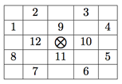
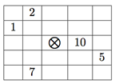

## 문제

The great hall of the national museum has been robbed few times recently. Everyone is now worried about the security of the treasures on display. To help secure the hall, the museum contracted with a private security company to provide additional guards to stay in the great hall and keep an eye on the ancient artifacts. The museum would like to hire the minimum number of additional guards so that the great hall is secured.

The great hall is represented as a two dimensional grid of R × C cells. Some cells are already occupied with the museum’s guards. All remaining cells are occupied by artifacts of different types (statues, sculptures, . . . etc.) which can be replaced by new hired guards. For each artifact, few other cells in the hall are identified as critical points of the artifact depending on the artifact value, type of vault it is kept inside, and few other factors. In other words, if this artifact is going to stay in the hall then all of its critical points must have guards standing on them. A guard standing in a critical position of multiple artifacts can keep an eye on them all. A guard, however, can not stand in a cell which contains an artifact (instead, you may remove the artifact to allow the guard to stay there). Also you can not remove an artifact and leave the space free (you can only replace an artifact with a new hired guard).

Surveying all the artifacts in the great hall you figured out that the critical points of any artifact (marked by a ⊗) are always a subset of the 12 neighboring cells as shown in the grid below.



Accordingly, the type of an artifact can be specified as a non-negative integer where the i-th bit is 1 only if critical point number i from the picture above is a critical point of that artifact. For example an artifact of type 595 (in binary 1001010011) can be pictured as shown in the figure below. Note that bits are numbered from right to left (the right-most bit is bit number 1.) If a critical point of an artifact lies outside the hall grid then it is considered secure.



You are given the layout of the great hall and are asked to find the minimum number of additional guards to hire such that all remaining artifacts are secured.

## 입력

Your program will be tested on one or more test cases. Each test case is specified using R+1 lines. The first line specifies two integers (1 ≤ R, C ≤ 50) which are the dimensions of the museum hall. The next R lines contain C integers separated by one or more spaces. The j-th integer of the i-th row is -1 if cell (i, j) already contains one of the museum’s guards, otherwise it contains an integer (0 ≤ T < 212) representing the type of the artifact in that cell.

The last line of the input file has two zeros.

## 출력

For each test case, print the following line:

```

k. G
```

Where k is the test case number (starting at one,) and G is the minimum number of additional guards to hire such that all remaining artifacts are secured.
