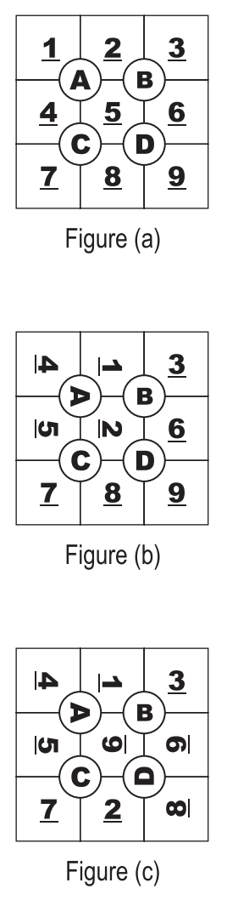

## 문제

The game of Tobo is played on a plastic board designed into a 3x3 grid with cells numbered from 1 to 9 as shown in figure (a). The grid has four dials (labeled ”A” to ”D” in the figure.) Each dial can be rotated in 90 degrees increment in either direction. Rotating a dial causes the four cells currently adjacent to it to rotate along. For example, figure (b) shows the Tobo after rotating dial ”A” once in a clockwise direction. Figure (c) shows the Tobo in figure (b) after rotating dial ”D” once in a counter- clockwise direction.

Kids love to challenge each other playing the Tobo. Starting with the arrangement shown in figure (a), (which we’ll call the standard arrangement,) one kid would randomly rotate the dials, X number of times, in order to ‘shuffle” the board. Another kid then tries to bring the board back to its standard arrangement, taking no more than X rotations to do so. The less rotations are needed to restore it, the better. This is where you see a business opportunity. You would like to sell these kids a program to advise them on the minimum number of steps needed to bring a Tobo back to its standard arrangement.

## 입력

Your program will be tested on one or more test cases. Each test case is specified on a line by itself. Each line is made of 10 decimal digits. Let’s call the first digit Y. The remaining 9 digits are non-zeros and describe the current arrangement of the Tobo in a row-major top-down, left-to-right ordering. The first sample case corresponds to figure (c).

The last line of the input file is a sequence of 10 zeros.

## 출력

For each test case, print the result using the following format:

k.␣R

where k is the test case number (starting at 1,) ␣ is a single space, and R is the minimum number of rotations needed to bring the Tobo back to its standard arrangement. If this can’t be done in Y dials or less, then R=-1.
