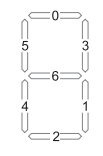
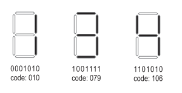
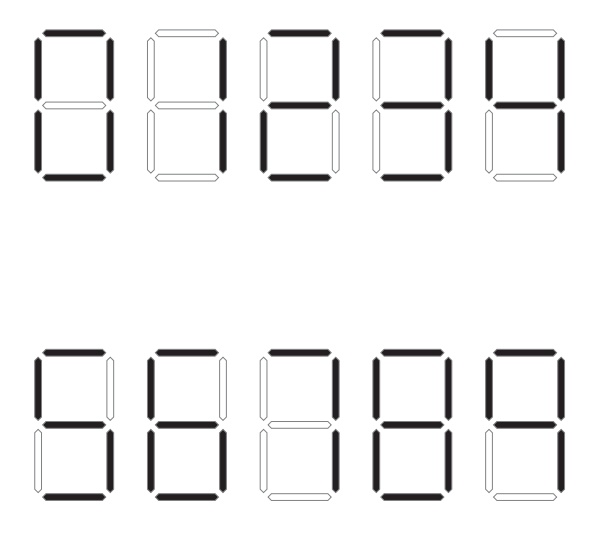

## 문제

7 세그먼트 디스플레이는 오른쪽 그림과 같이 일곱개의 LED로 이루어져 있다. 각각의 LED는 켜있거나 꺼져있을 수 있고, 독립적으로 작동한다. 이러한 LED의 조합은 총 127가지가 있으며, 주로 숫자 0부터 9까지를 표현하는데 사용된다.

프로그래머는 이 디스플레이에 7비트 숫자를 전송해서 조정할 수 있다. 예를 들어, 1을 표시하려면 1번과 3번 LED만 켜야한다. 따라서, 0001010을 전송하면 된다. 이 7비트 숫자를 코드라고 하며, 보통 10진수로 표현한다.

LED의 조합은 총 127가지가 있기 때문에, 코드는 3자리 숫자로 나타낼 수 있다. 예를 들어, 1은 0001010을 전송하면 되고 이 수의 10진수 값은 10이기 때문에, 코드로는 010으로 나타낸다.

한 자리 이상의 수를 나타낼 때는 코드를 이어서 사용하면 된다. 예를 들어, 13은 010079로 나타내면 되고, 144는 010106106으로 나타내면 된다.

7 세그먼트 디스플레이 상에서 코드로 나타낸 두 수가 주어졌을 때, 두 수의 합을 7 세그먼트 디스플레이에서 코드로 출력하는 프로그램을 작성하시오.

## 입력

입력은 여러 개의 테스트 케이스로 이루어져 있다. 각 테스트 케이스는 A+B=꼴이며, A와 B는 두 수 a와 b를 7 세그먼트 디스플레이 상에서의 코드로 표현한 값이다. (0 < a,b < a+b < 1,000,000,000) 마지막 줄에는 BYE가 주어진다.

## 출력

각 테스트 케이스에 대해서, 한 줄에 하나씩 A+B=C를 출력한다. A와 B는 입력에서 주어진 값이며, C는 a+b를 다시 7 세그먼트 디스플레이 코드로 나타낸 값이다.

## 힌트

