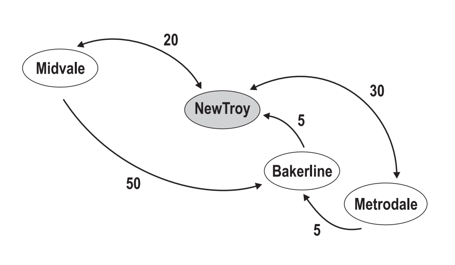

## 문제

Einbahnstraße (German for a one-way street) is a street on which vehicles should only move in one direction. One reason for having one-way streets is to facilitate a smoother flow of traffic through crowded areas. This is useful in city centers, especially old cities like Cairo and Damascus. Careful planning guarantees that you can get to any location starting from any point. Nevertheless, drivers must carefully plan their route in order to avoid prolonging their trip due to one-way streets. Experienced drivers know that there are multiple paths to travel between any two locations. Not only that, there might be multiple roads between the same two locations. Knowing the shortest way between any two locations is a must! This is even more important when driving vehicles that are hard to maneuver (garbage trucks, towing trucks, etc.)

You just started a new job at a car-towing company. The company has a number of towing trucks parked at the company’s garage. A tow-truck lifts the front or back wheels of a broken car in order to pull it straight back to the company’s garage. You receive calls from various parts of the city about broken cars that need to be towed. The cars have to be towed in the same order as you receive the calls. Your job is to advise the tow-truck drivers regarding the shortest way in order to collect all broken cars back in to the company’s garage. At the end of the day, you have to report to the management the total distance traveled by the trucks.

## 입력

Your program will be tested on one or more test cases. The first line of each test case specifies three numbers (N, C, and R) separated by one or more spaces. The city has N locations with distinct names, including the company’s garage. C is the number of broken cars. R is the number of roads in the city. Note that 0 < N < 100, 0 ≤ C < 1000, and R < 10000. The second line is made of C + 1 words, the first being the location of the company’s garage, and the rest being the locations of the broken cars. A location is a word made of 10 letters or less. Letter case is significant. After the second line, there will be exactly R lines, each describing a road. A road is described using one of these three formats:

                                           A --v-> B  
                                           A <-v-- B  
                                           A <-v-> B

A and B are names of two different locations, while v is a positive integer (not exceeding 1000) denoting the length of the road. The first format specifies a one-way street from location A to B, the second specifies a one-way street from B to A, while the last specifies a two-way street between them. A, ”the arrow”, and B are separated by one or more spaces. The end of the test cases is specified with a line having three zeros (for N, C, and R.)

## 출력

For each test case, print the total distance traveled using the following format:

k.␣V

Where k is test case number (starting at 1,) ␣ is a space, and V is the result.

## 힌트

