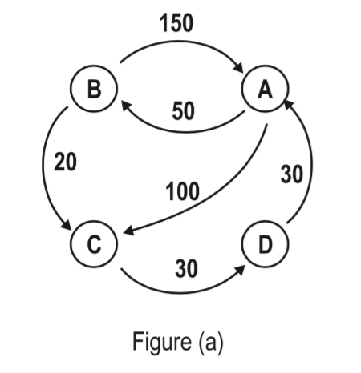
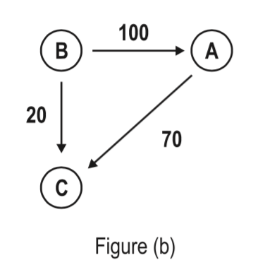

## 문제

Falling Stocks. Bankrupted companies. Banks with no Cash. Seems like the best time to invest: “Think I’ll buy me a football team!”

No seriously, I think I have the solution to at least the problem of cash in banks. Banks nowadays are all owing each other great amounts of money and no bank has enough cash to pay other banks’ debts even though, on paper at least, they should have enough money to do so. Take for example the inter-bank loans shown in figure (a). The graph shows the amounts owed between four banks (A. . . D). For example, A owes B 50M while, at the same time, B owes A 150M. (It is quite common for two banks to owe each other at the same time.) A total amount of 380M in cash is needed to settle all debts between the banks.

In an attempt to decrease the need for cash, and after studying the example carefully, I concluded that there’s a lot of cash being transferred unnecessarily. Take a look:

C owes D the same amount as D owes A, so we can say that C owes A an amount of 30M and get D out of the picture.  
But since A already owes C 100M, we can say that A owes C an amount of 70M.  
Similarly, B owes A 100M only, (since A already owes B 50M.) This reduces the above graph to the one shown in figure (b) which reduces the needed cash amount to 190M (A reduction of 200M, or 53%.)  
I can still do better. Rather than B paying A 100M and A paying 70M to C, B can pay 70M (out of A’s 100M) directly to C. This reduces the graph to the one shown in figure (c). Banks can settle all their debts with only 120M in cash. A total reduction of 260M or 68%. Amazing!

I have data about inter-bank debts but I can’t seem to be able to process it to obtain the minimum amount of cash needed to settle all the debts. Could you please write a program to do that?

## 입력

Your program will be tested on one or more test cases. Each test case is specified on N + 1 lines where N < 1, 000 is the number of banks and is specified on the first line. The remaining N lines specifies the inter-bank debts using an N × N adjacency matrix (with zero diagonal) specified in row-major order. The ith row specifies the amounts owed by the ith bank. Amounts are separated by one or more spaces. All amounts are less than 1000.

The last line of the input file has a single 0.

## 출력

For each test case, print the result using the following format:

k.␣B␣A

where k is the test case number (starting at 1,) ␣ is a space character, B is the amount of cash needed before reduction and A is the amount of cash after reduction.
