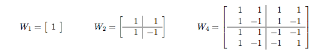
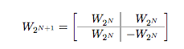

## 문제

월쉬 행렬이란 행렬의 크기가 2의 제곱이며, 행렬의 원소가 +1 또는 -1인 정사각형 행렬이다.

이 행렬의 가장 큰 특징은 임의의 두 행(또는 열)의 스카라 곱이 0인 것이다.

아래는 처음 셋 월쉬 행렬이다. (회색 선은 보기 편하게 하기 위해 그은 것)

크기가 2N+1인 월쉬 행렬은 크기가 2N인 4개의 월쉬 행렬을 합쳐서 만들 수 있다. 오른쪽 아래 행렬은 다른 세 행렬과 다르게 모든 원소를 반전시켜서 넣어야 한다.

월쉬 행렬의 행의 번호를 위에서 부터 0번이라고 하고, 열의 번호는 왼쪽에서 부터 0이라고 하자. 이때 N, R, S, E가 주어졌을 때, 크기가 2N인 월쉬 행렬에서 R행 S열부터 R행 E열까지 합을 구하는 프로그램을 작성하시오.

## 입력

입력은 여러 개의 테스트 케이스로 이루어져 있다. 각 테스트 케이스는 네 정수 N, R, S, E로 이루어져 있다. (0 ≤ N ≤ 60, 0 ≤ R < 2N, 0 ≤ S ≤ E < 2N, E − S ≤ 10,000)

마지막 줄에는 -1이 4개 주어진다.

## 출력

각 테스트 케이스에 대해서 정답을 출력한다.
