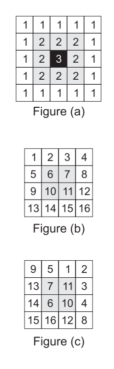

## 문제

Any square grid can be viewed as one or more rings, one inside the other. For example, as shown in figure (a), a 5 ∗ 5 grid is made of three rings, numbered 1,2 and 3 (from outside to inside.) A square grid of size N is said to be sorted, if it includes the values from 1 to N2 in a row-major order, as shown in figure (b) for N = 4. We would like to determine if a given square grid can be sorted by only rotating its rings. For example, the grid in figure (c) can be sorted by rotating the first ring two places counter-clockwise, and rotating the second ring one place in the clockwise direction.

## 입력

Your program will be tested on one or more test cases. The first input line of a test case is an integer N which is the size of the grid. N input lines will follow, each line made of N integer values specifying the values in the grid in a row-major order. Note than 0 < N ≤ 1, 000 and grid values are natural numbers less than or equal to 1,000,000.

The end of the test cases is identified with a dummy test case with N = 0.

## 출력

For each test case, output the result on a single line using the following format:

k.␣result

Where k is the test case number (starting at 1,) ␣ is a single space, and result rings.(c|cpp|java) rings.in is "YES" or "NO" (without the double quotes.)
