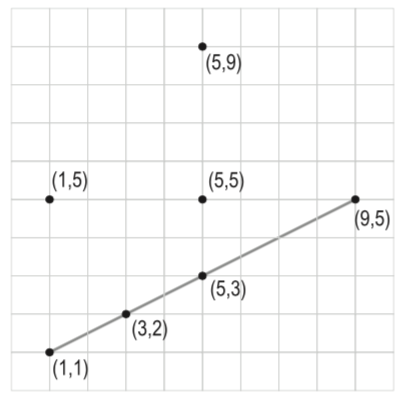

## 문제

Unlike a straight line, a straight segment between two points P1, P2 (normally written as P1P2) is a line that links the two points but doesn’t extend beyond them. A third point P3 is said to be incident to P1P2 if P3 lies on the straight line and between the points P1 and P2. P1P2 is said to include P3. By definition, P1 and P2 are included in P1P2. Write a program to find the segment that includes the most number of given points.

## 입력

Your program will be tested on one or more test cases. Each test case includes a set of two or more unique points, where the Cartesian coordinates of each point is specified on a separate line using two integers X and Y where 0 ≤ |X| , |Y| < 1, 000, 000. No test case has more than 1000 points. An input line made of two or more ’-’ (minus signs) signals the end of a test case. An extra input line of two or more ’-’ (minus signs) follow the last test case.

## 출력

For each test case, output the result on a single line using the following format:

k.␣n

Where k is the test case number (starting at 1,) ␣ is a single space, and n is the number of points on the segment.
