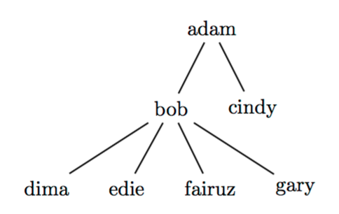

## 문제

A favorite pastime for big families in Acmestan is going to the movies. It is quite common to see a number of these multi-generation families going together to watch a movie. Movie theaters in Acmestan have two types of tickets: A single ticket is for exactly one person while a family ticket allows a parent and their children to enter the theater. Needless to say, a family ticket is always priced higher than a single ticket, sometimes as high as five times the price of a single ticket.

It is quite challenging for families to decide which ticket arrangement is most economical to buy. For example, the family depicted in the figure on the right has four ticket arrangements to choose from: Seven single tickets; Two family tickets; One family ticket (for adam, bob, cindy) plus four single tickets for the rest; Or, one family ticket (for bob and his four children) plus single tickets for the remaining two.

Write a program to determine which ticket arrangement has the least price. If there are more than one such arrangement, print the arrangement that has the least number of tickets.

## 입력

Your program will be tested on one or more test cases. The first line of each test case includes two positive integers (S and F) where S is the price of a single ticket and F is the price of a family ticket. The remaining lines of the test case are either the name of a person going by him/herself, or of the form:

N1 N2 N3 ... Nk

where N1 is the name of a parent, with N2 . . . Nk being his/her children. Names are all lower-case letters, and no longer than 1000 characters. No parent will be taking more than 1000 of their children to the movies :-). Names are unique, the name of a particular person will appear at most twice: Once as a parent, and once as a child. There will be at least one person and at most 100,000 people in any test case.

The end of a test case is identified by the beginning of the following test case (a line made of two integers.) The end of the last test case is identified by two zeros.

## 출력

For each test case, write the result using the following format:

k.␣NS␣NF␣T

Where k is the test case number (starting at 1,) ␣ is a single space, NS is the number of single tickets, NF is the number of family tickets, and T is the total cost of tickets.
