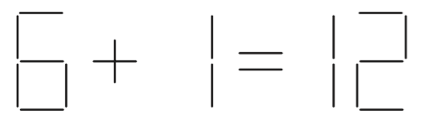
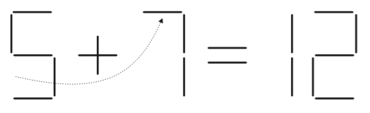
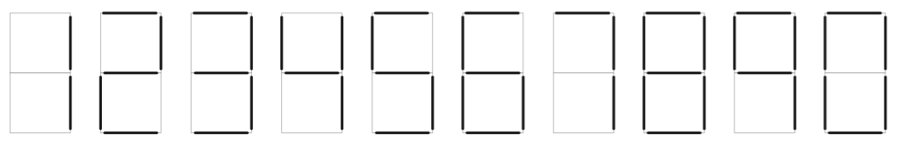

## 문제

Here’s a simple puzzle: Move one stick in the figure below to make the equation correct.

Easy, right? Here’s the solution:

Write a program to solve similar puzzles knowing that:

1. Each puzzle is made of a left operand, an operator, a right operand, an equal sign, and a result. The two operands and the result are numbers, made of one or more digits, and is less than 231.
2. The operator and the equal sign cannot be changed. You’re only allowed to move sticks making up the digits.
3. You can neither remove digits completely nor introduce new ones. (i.e. You can only alter the digits.)
4. Leading zeros are allowed in both the input and output. Leading zeros in the output must be printed.
5. Each puzzle specifies the number of required moves. Your solution must move as many sticks as specified. A stick is moved at most once; It cannot be moved again. If a stick is moved, its original place must remain vacant. (i.e. you cannot move another stick to that place.)
6. When solving a puzzle involving division, the division must be an exact integer division, i.e. no remainder.
7. Digits are “written” as follows:

## 입력

Your program will be tested on one or more test cases. Each test case is specified on a single line using the following format:

A ⊙ B = R (n)

where A, B, and R are sequences of one or more digits, but no more than nine digits. ⊙ is one of the four operators: + - \* /. n is a natural number representing the number of sticks to move. One or more spaces separate A, ⊙, B, =, R, and (n).

The end of the test cases is indicated by a separate line having the word "EOF" (without the quotes.)

## 출력

For each puzzle, your program must print one line of the form:

k.␣result

Where k is the puzzle number (starting at 1,) ␣ is a single space, and result is the equation after solving the puzzle. result includes no spaces.

In the case of multiple solutions, print just one. If the puzzle can’t be solved, print "UNSOLVABLE" (without the quotes) as the result.
