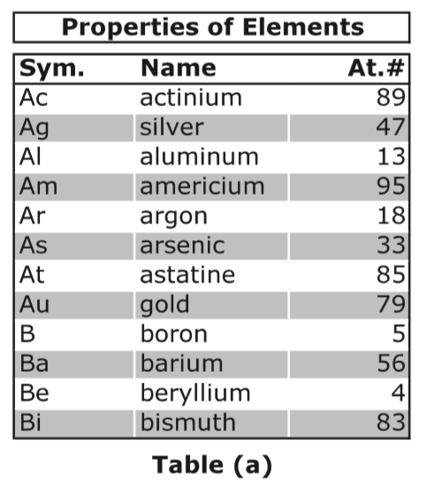
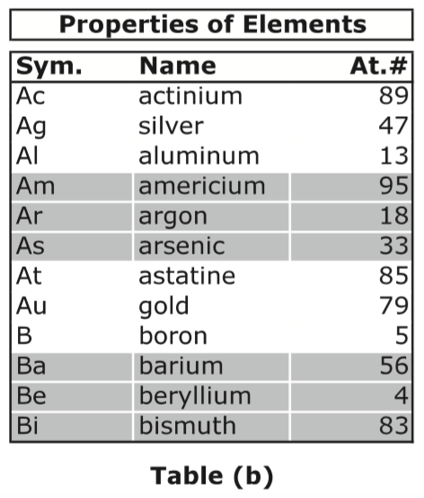

## 문제

A web template engine is a software that is designed to process web templates and content information to produce web documents. A template is an html page, but without the content. In a way, a template system facilitates the separation between the information in a web page, and the presentation of it.

A template system normally comes with a (restricted and specialized) programming language to allow the variation of the presentation depending on certain properties of the information. For example, when presenting a bank statement, the bank may decide to display in red any transaction with an amount above \$1,000 in order to grab the attention of the user.

Another technique, frequently used in printing tables, is to alternate the background color of rows to make it easier for the reader to visually follow a row. For example, the background color in Table (a) alternates after each row, while in Table (b) the color alternates every three rows.

A properly designed template language would have a construct to allow the designer to alternate the properties of table rows. In this problem we shall concentrate on one such construct that takes three arguments: N, P1, and P2. The template engine would then apply P1 on the first N rows, P2 on the second N rows, and then back to P1 on the third N rows, and so on.

Write a program that takes the current row number (starting at one,) the number N, and properties P1, and P2 and determines which of P1 or P2 should be applied to the current row.

## 입력

Your program will be tested on one or more test cases. Each test case is specified on a separate line. Each line specifies four values: R, N, P1, and P2, all separated by one or more spaces.

R is the current row number (first row is numbered 1) while N is as described above. Note that 0 < R,N < 1,000,000,000.

P1 and P2 are properties. A property is a string made of upper- or lower-case letters, digits, and/or spaces. A property may be surrounded by double quotes, (but the double quotes are not part of the property.) If a property contains spaces, the surrounding double quotes are mandatory. No property will be longer than 512 characters (including the double quotes, if present.)

The last line of the input file is made of a single zero.

## 출력

For each test case, output the result on a single line using the following format:

k.␣result

Where k is the test case number (starting at 1,) and result is P1 or P2. Note that the double quotes are never printed. In addition, all letters are printed in lower case.
