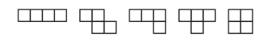
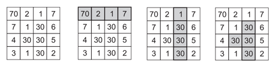

## 문제

테트리스는 아래와 같은 5가지 조각으로 이루어져 있다.

정수로 이루어진 N×N 표가 주어진다. 테트리스 블록 중 하나를 표에 놓아 블록 아래에 있는 숫자의 합의 최댓값을 구하는 프로그램을 작성하시오.

모든 테트리스 블록은 90도씩 회전시킬 수 있다. 일부 조각은 총 4가지 형태를 가질 수 있다. 블록이 모두 표 안에 들어있는 형태는 모두 가능한 형태이다.

예를 들어, 가장 왼쪽 블록을 첫 행에 놓으면 합 80을 얻을 수 있다. 90도 회전시켜 셋째 열에 놓으면 91을 얻을 수 있다.

표의 크기가 4×4인 경우에 블록을 놓는 방법의 수는 총 77가지이다. 위의 예제에서 가장 큰 합은 120이다.

## 입력

입력은 여러 개의 테스트 케이스로 이루어져 있다. 각 테스트 케이스의 첫째 줄에는 표의 크기 N이 주어지고, 4 ≤ N ≤ 100을 만족한다. 둘째 줄부터 표에 쓰여 있는 숫자가 주어진다. 숫자는 절댓값이 1,000,000을 넘지 않는 정수이다.

입력의 마지막 줄에는 0이 하나 주어진다.

## 출력

각 테스트 케이스 마다, 케이스 번호를 출력하고 가장 큰 합을 출력한다.
