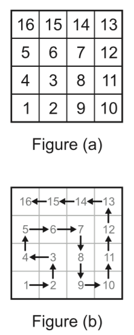

## 문제

Walk Like an Egyptian is an old multi-player board game played by children of the Sahara nomad tribes. Back in the old days, children would collect stones, and number each one of them. A game with N players requires N2 stones. Each player chooses N stones. The stones are then laid out on an N × N grid in a peculiar order as in Figure (a) (for N = 4.) The player whose stone is placed in the top-right corner loses the round. Another round is then played but with N − 1 players. In total, N − 1 rounds are played to determine the winner.

There is a story why the stones are arranged in this order. It is said that back in the days of the Pharaohs, when entering a dark room in a Pyramid, workers would use the following “algorithm” to be able to walk in the room without losing anybody: (see Figure (b)).

1. The first worker stands in the lower-left corner of the room.  
2. The next three workers stand around the first forming a quarter of a circle by going in an anti-clockwise direction.  
3. The next five workers stand around the last three, again forming a quarter of a circle but this time going in a clockwise direction.  
4. The workers keep repeating the last two steps until the room is filled with workers. Each time they hit the left or bottom walls, they start a larger quarter circle and alternate their direction between clockwise and anti-clockwise.

Write a program that determines the stone placed on the top-right corner.

## 입력

Your program will be tested on one or more test cases. Each test case is specified on a separate input line. Each test case will specify the number of players N where 0 < N < 1, 000.

The end of the test cases is indicated by a line made of a single zero.

## 출력

For each test case, output the result on a single line using the following format:

N␣=>␣result

Where N is the number of players for the this test case, and result is the number on the stone placed at the top-right corner of the grid.
