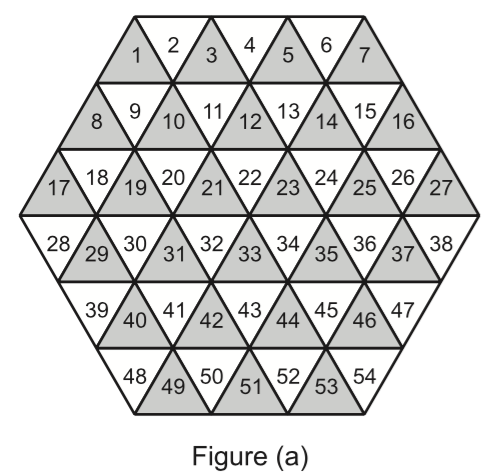
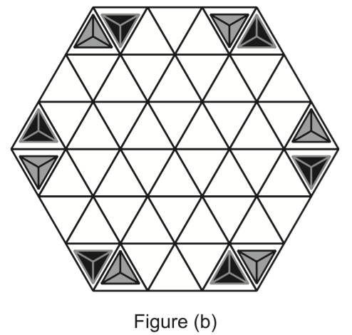
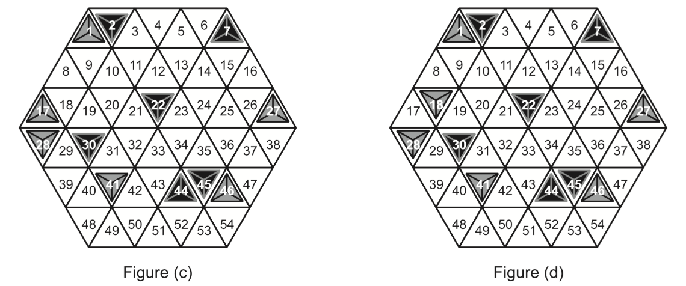

## 문제

Sahara is a two player board game played on a hexagon-shaped grid made out of 54 triangles as the one shown in Figure (a). Each player has 6 (tetraeder) pyramids, initially placed as seen Figure (b). Player one has the dark pyramids, player two has the lighter ones. The players take turns in moving one of their own pyramids. A pyramid is moved by tipping the pyramid on its side into an adjacent space. For example, a pyramid at location 11 can be moved to location 3, 10, or 12 (assuming the destination location is free.)

The objective of the game is to trap a pyramid of the opponent. A pyramid is trapped if it can’t be moved. For example, a pyramid at location 11 is trapped if locations 3, 10, and 12 are all occupied (regardless of which player’s pyramids occupy these locations.) Similarly, a pyramid at location 28 is trapped if both locations 17 and 29 are occupied. For example, in Figure (c) on the next page, player one can win the game by moving his pyramid from location 30 to location 29 and thus trapping the opponent’s pyramid at location 28.

Write a program that determines if the first player can trap an opponent’s pyramid in a single move.

## 입력

Your program will be tested on one or more test cases. Each test case is specified on a single line. Each test case is made of 12 numbers in the range [1,54]. The first six numbers specify the locations of the first player’s pyramids. The last six are for the second player. The locations are numbered in the same way as in Figure (a). Numbers are separated using one or more spaces. All test cases specify a valid game position where no pyramid is already trapped.

The last line of the input file will have a single zero.

## 출력

For each test case, output the result on a single line using the following format:

k.␣result

Where k is the test case number (starting at 1,) and result is "TRAPPED" if the first player can trap a pyramid of the opponent by moving one of his pyramids. Otherwise, result is "FREE".

## 힌트

The first test case corresponds to figure (c) while the second to figure (d).

