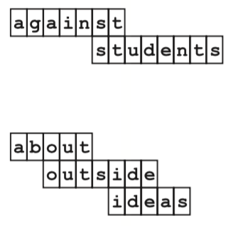

## 문제

A-to-Z is a game usually played by kids in elementary schools to help them improve their spelling skills and to enrich their vocabulary. The game comes with a set of words, each word written on a piece of plastic. Children challenge each other by picking two letters (let’s call them C1 and C2) and then trying to connect these letters by finding a sequence of one or more words (we’ll refer to them as W1, W2, . . . , Wn) where the first word W1 starts with C1 and the last word Wn ends with C2. Each two consecutive words in the sequence (Wi, Wi+1) must overlap with at least two letters. Word X overlaps by k letters with word Y if the last k letters of X are the same as the first k letters of Y . Take for example the figure on the right, where ’a’ was connected to ’s’ using the two-word sequence "against" and "students".

To determine the winner of the game, each sequence is assigned a penalty which is equal to the number of letters in the sequence (but overlapping letters are counted only once.) The player with the least penalty wins. Going back to the figure, the first sequence "against students" has a penalty of 13, while the second sequence "about outside ideas" has a penalty of 11. You can think of the penalty as the width taken when the sequence is laid out as in the figure. The winning sequence is the one with the smallest width.

Write a program that takes a dictionary of words and determines the winning sequence connecting two given letters.

## 입력

Your program will be tested on one or more test cases. Each test case specifies a dictionary of words, and a list of one or more character pairs (called queries,) to connect using the dictionary.

The first line of a test case is a positive number w which denotes the number of words in the dictionary. The words are listed starting at the second line: One word per line. Words are made of lowercase letters only. No word is longer than 64 characters. A dictionary has at most 50,000 words.

Following the dictionary, q queries are specified using q+1 lines. The first line specifies the number of queries, q. Each query is specified on a separate line. Each query specifies two lowercase letters C1 and C2.

The end of the test cases is identified with an input line that contains a single integer w = 0 (which is not part of the test cases.)

## 출력

For each query, write the result on a separate line. If there is no sequence connecting the two letters, your program should print:

a.b␣0

where a is the test case number (starting at 1,) and b is the query number within this test case (again starting at 1.)

If, however, there is a sequence, your program should print the following:

a.b␣p␣word-1␣word-2␣...␣word-n

Where a, b are as described previously, p is the penalty of the sequence. word-1, word-2, . . . word-n is the sequence, where word-1 starts with C1, word-n ends with C2, and each two consecutive words overlap with at least two characters. Remember, we’re interested in the sequence with the minimum possible penalty in the given dictionary.

(If there are more than one solution for a query, print any of them.)
