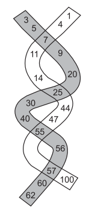

## 문제

길이가 유한하고, 오름차순 순서로 되어있는 두 수열이 주어진다. 두 수열에 공통으로 들어있는 원소는 교차점으로 생각할 수 있다.

아래는 두 수열과 교차점은 굵게 나타낸 것이다.

수열 1 = 3 5 **7** 9 20 **25** 30 40 **55** 56 **57** 60 62

수열 2 = 1 4 **7** 11 14 **25** 44 47 **55** **57** 100

이 두 수열은 다음과 같이 걸을 수 있다.

1. 두 수열중 하나의 첫 번째 원소에서 걷기를 시작한다. 걷는 것은 앞으로만 걸을 수 있다.
2. 교차점에 도착했을 때는, 현재 수열에서 계속 걸을지, 다른 수열로 갈아탈지 결정할 수 있다.

방문한 수의 합이 최대가 되는 경로를 구하는 프로그램을 작성하시오. 위의 예에서 3, 5, 7, 9, 20, 25, 44, 47, 55, 56, 57, 60, 62와 같이 걷는다면 합이 450으로 최대가 된다.

## 입력

입력은 여러 개의 테스트 케이스로 이루어져 있다. 각 테스트 케이스는 두 줄로 이루어져 있다.

각 줄의 첫 번째 수는 수열의 길이이다. 그 다음에는 수열의 원소가 순서대로 주어진다. 수열의 길이는 1이상이고, 10,000을 넘지 않는다. 수열에 들어있는 모든 수는 -10,000보다 크거나 같고, 10,000보다 작거나 같은 정수이다.

입력의 마지막 줄에는 0이 하나 주어진다.

## 출력

각 테스트 케이스에 대해서, 얻을 수 있는 최대 합을 출력한다.
