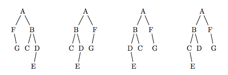

## 문제

두 바이너리 트리 A와 B는 다음과 같은 두 조건을 만족할 때 동등하다고 한다.

1. 두 트리가 비어있다. 또는,

2. 두 트리의 루트가 같다. 또:

(a) A의 왼쪽 서브 트리가 B의 왼쪽 서브 트리와 동등하고, A의 오른쪽 서브 트리가 B의 오른쪽 서브 트리와 동등하다. 또는,

(b) A의 왼쪽 서브 트리가 B의 오른쪽 서브 트리와 동등하고, A의 오른쪽 서브 트리가 B의 왼쪽 서브 트리와 동등하다.

예를 들어, 아래 왼쪽 3개 트리는 서로 동등하다. 하지만, 가장 오른쪽 트리와는 동등하지 않다.

두 바이너리 트리가 주어졌을 때, 동등한지 아닌지 구하는 프로그램을 작성하시오.

## 입력

첫째 줄에 테스트 케이스의 개수 T가 주어진다. 각 테스트 케이스는 두 줄로 이루어져 있다. 각 줄은 비교해야 하는 트리의 정보이다.

각 트리의 정보는 포스트오더로 주어진다. 서브트리가 없는 경우에는 nil로 주어진다. 트리의 모든 데이터는 알파벳 대문자이다. 각 줄의 마지막은 end가 있다. 예를 들어, 문제 설명의 가장 왼쪽 그림을 포스트오더로 나타내면 다음과 같다.

nil nil nil G F nil nil C nil nil E nil D B A end

## 출력

각 테스트 케이스에 대해서, 두 트리가 동등하면 true를, 아니면 false를 출력한다.
