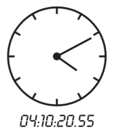
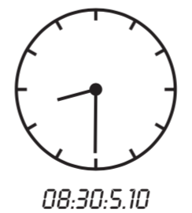

## 문제

Consider a classical 2-arm 12-hour clock. Now imagine a really precise one. One that can indicate the time in hours, minutes, seconds, and hundredths of a second. Such clock can specify the time between 0:0:0.00 and 11:59:59.99 inclusive. (We’ll use the format hour:minute:second.hundredths) to write the time displayed on such clock. Now, you are given two identical clocks of this type, each of them showing some time where the first is strictly before the second. You also know the radius of the clock face. We’re interested in computing the area of the clock face determined by the two small (hour) clock-arms on the two clocks. The area starts from the position of the first hour clock-arm and continues in the clockwise way till the position of the second hour clock-arm.

## 입력

Your program will be tested on one or more test cases. The first line in the input specifies a single integer D representing the number of test cases. The first line will be followed by D test cases, where each case is specified on three lines. The first line in a test case specifies four integers denoting the time on the first clock using the following format:

H M S U

with H for hours, M for minutes, S for seconds, and U for hundredth of a second. Note that 0 ≤ H < 12, 0 ≤ M < 60, 0 ≤ S < 60, and 0 ≤ U < 100. The second line of a test case specifies the time on the second clock, using the same format as the first.

The third line specifies a real number denoting the radius of the clock. The maximum for the radius is 10,000.

## 출력

For each test case, output the result on a single line using the following format:

k.␣f

Where k is the test case number (starting at 1,) and f is the answer, rounded to three decimal places.
