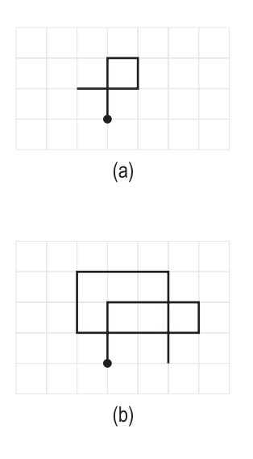

## 문제

Imagine a 2D diagram drawn in the following way: Starting at the origin, you’re given a sequence of letters which is entirely made of the following four letters ’U’, ’D’, ’L’, and ’R’. A ’U’ is an instruction for you to move one unit upward and drawing a segment at the same time. Similarly, ’D’ is for moving down, ’L’ for left, and ’R’ for right. For example, figure (a) is drawn by giving the sequence ’UURDLL’ while figure (b) is the result of ’UURRRDLLLLUURRRDDD’ (in both figures, the starting point is identified by a small circle.)

While segments are allowed to intersect, they’re not allowed to overlap. In other words, any two segments will have, at most, one point in common. We’re interested in knowing the number of closed polygons, not containing any lines inside, in such diagrams. Figure (a), has only one closed polygon while figure (b) has three. Write a program to do exactly that.

## 입력

Your program will be tested on one or more test cases. Each test case is specified on a separate line. The diagram is specified using a sequence made entirely of (U|D|L|R) and terminated by the letter ’Q’. All letters are capital letters. None of the segments in a test case will overlap. The end of test cases is identified by the letter ’Q’ on a line by itself.

## 출력

For each test case, write the answer on a separate line.
