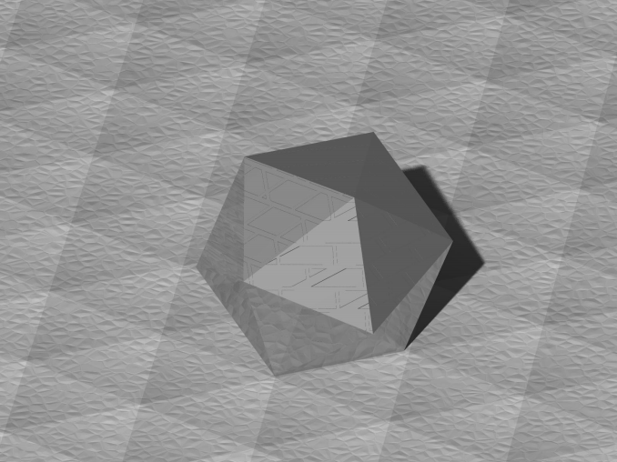
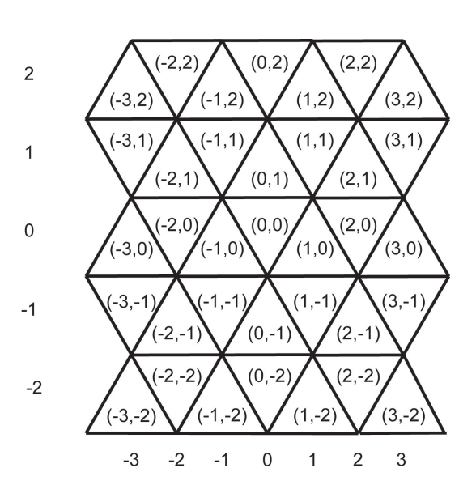
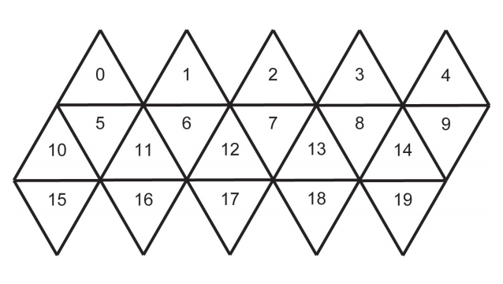

## 문제

After decades of fruitless efforts, one of the expedition teams of ITO (Intersolar Tourism Organization) finally found a planet that would surely provide one of the best tourist attractions within a ten light-year radius from our solar system. The most attractive feature of the planet, besides its comfortable gravity and calm weather, is the area called Mare Triangularis. Despite the name, the area is not covered with water but is a great plane. Its unique feature is that it is divided into equilateral triangular sections of the same size, called trigons. The trigons provide a unique impressive landscape, a must for tourism. It is no wonder the board of ITO decided to invest a vast amount on the planet.

Despite the expected secrecy of the staff, the Society of Astrogeology caught this information in no time, as always. They immediately sent their president’s letter to the Institute of Science and Education of the Commonwealth Galactica claiming that authoritative academic inspections were to be completed before any commercial exploitation might damage the nature.

Fortunately, astrogeologists do not plan to practice all the possible inspections on all of the trigons; there are far too many of them. Inspections are planned only on some characteristic trigons and, for each of them, in one of twenty different scientific aspects.

To accelerate building this new tourist resort, ITO’s construction machinery team has already succeeded in putting their brand-new invention in practical use. It is a rover vehicle of the shape of an icosahedron, a regular polyhedron with twenty faces of equilateral triangles. The machine is customized so that each of the twenty faces exactly fits each of the trigons. Controlling the high-tech gyromotor installed inside its body, the rover can roll onto one of the three trigons neighboring the one its bottom is on.

Figure E.1: The Rover on Mare Triangularis

Each of the twenty faces has its own function. The set of equipments installed on the bottom face touching the ground can be applied to the trigon it is on. Of course, the rover was meant to accelerate construction of the luxury hotels to host rich interstellar travelers, but, changing the installed equipment sets, it can also be used to accelerate academic inspections.

Figure E.2: The Coordinate System

Figure E.3: Face Numbering

You are the driver of this rover and are asked to move the vehicle onto the trigon specified by the leader of the scientific commission with the smallest possible steps. What makes your task more difficult is that the designated face installed with the appropriate set of equipments has to be the bottom. The direction of the rover does not matter.

The trigons of Mare Triangularis are given two-dimensional coordinates as shown in Figure E.2. Like maps used for the Earth, the x axis is from the west to the east, and the y axis is from the south to the north. Note that all the trigons with its coordinates (x, y) has neighboring trigons with coordinates (x − 1, y) and (x + 1, y). In addition to these, when x + y is even, it has a neighbor (x, y + 1); otherwise, that is, when x + y is odd, it has a neighbor (x, y − 1).

Figure E.3 shows a development of the skin of the rover. The top face of the development makes the exterior. That is, if the numbers on faces of the development were actually marked on the faces of the rover, they should been readable from its outside. These numbers are used to identify the faces.

When you start the rover, it is on the trigon (0, 0) and the face 0 is touching the ground. The rover is placed so that rolling towards north onto the trigon (0, 1) makes the face numbered 5 to be at the bottom.

As your first step, you can choose one of the three adjacent trigons, namely those with coordinates (−1, 0), (1, 0), and (0, 1), to visit. The bottom will be the face numbered 4, 1, and 5, respectively. If you choose to go to (1, 0) in the first rolling step, the second step can bring the rover to either of (0, 0), (2, 0), or (1, −1). The bottom face will be either of 0, 6, or 2, correspondingly. The rover may visit any of the trigons twice or more, including the start and the goal trigons, when appropriate.

The theoretical design section of ITO showed that the rover can reach any goal trigon on the specified bottom face within a finite number of steps.

## 입력

The input consists of a number of datasets. The number of datasets does not exceed 50.

Each of the datasets has three integers x, y, and n in one line, separated by a space. Here, (x, y) specifies the coordinates of the trigon to which you have to move the rover, and n specifies the face that should be at the bottom.

The end of the input is indicated by a line containing three zeros.

## 출력

The output for each dataset should be a line containing a single integer that gives the minimum number of steps required to set the rover on the specified trigon with the specified face touching the ground. No other characters should appear in the output.

You can assume that the maximum number of required steps does not exceed 100. Mare Triangularis is broad enough so that any of its edges cannot be reached within that number of steps.
