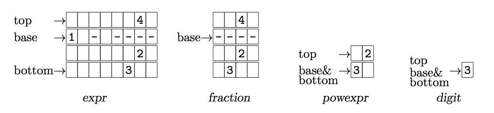

## 문제

Mathematical expressions appearing in old papers and old technical articles are printed with typewriter in several lines, where a fixed-width or monospaced font is required to print characters (digits, symbols and spaces). Let us consider the following mathematical expression.

\[\left( 1 - \frac{4}{3^2}\right)^2 \times -5 + 6\]

It is printed in the following four lines:

```

        4   2
( 1 - ---- )  * - 5 + 6
        2
       3
```

where “- 5” indicates unary minus followed by 5. We call such an expression of lines “ASCII expression”.

For helping those who want to evaluate ASCII expressions obtained through optical character recognition (OCR) from old papers, your job is to write a program that recognizes the structure of ASCII expressions and computes their values.

For the sake of simplicity, you may assume that ASCII expressions are constructed by the following rules. Its syntax is shown in Table H.1.

Table H.1: Rules for constructing ASCII expressions (similar to Backus-Naur Form) The box indicates the cell of the terminal or nonterminal symbol that corresponds to a rectangular region of characters. Note that each syntactically-needed space character is explicitly indicated by the period character denoted by `.` , here.

```

  (I)     expr ::= term | expr.+.term | expr.-.term
 (II)     term ::= factor | term.*.factor
(III)   factor ::= powexpr | fraction | -.factor
                                    digit
 (IV)  powexpr ::= primary | primary
  (V)  primary ::= digit | (.expr.)
                      expr
 (VI) fraction ::= ---------
                      expr
(VII)    digit ::= 0 | 1 | 2 | 3 | 4 | 5 | 6 | 7 | 8 | 9
```



Figure H.1: Top, base, bottom lines: expr \(1-\frac{4}{3^2}\), fraction \(\frac{4}{3^2}\), powexpr \(3^2\), digit \(3\).

1. Terminal symbols are ‘0’, ‘1’, ‘2’, ‘3’, ‘4’, ‘5’, ‘6’, ‘7’, ‘8’, ‘9’, ‘+’, ‘-’, ‘\*’, ‘(’, ‘)’, and ‘ ’.
2. Nonterminal symbols are expr, term, factor, powexpr, primary, fraction and digit. The start symbol is expr.
3. A “cell” is a rectangular region of characters that corresponds to a terminal or nonterminal symbol (Figure H.1). In the cell, there are no redundant rows and columns that consist only of space characters. A cell corresponding to a terminal symbol consists of a single character. A cell corresponding to a nonterminal symbol contains cell(s) corresponding to its descendant(s) but never partially overlaps others.
4. Each cell has a base-line, a top-line, and a bottom-line. The base-lines of child cells of the right-hand side of rules I, II, III, and V should be aligned. Their vertical position defines the base-line position of their left-hand side cell.
5. powexpr consists of a primary and an optional digit. The digit is placed one line above the base-line of the primary cell. They are horizontally adjacent to each other. The base-line of a powexpr is that of the primary.
6. fraction is indicated by three or more consecutive hyphens called “vinculum”. Its dividend expr is placed just above the vinculum, and its divisor expr is placed just beneath it. The number of the hyphens of the vinculum, denoted by wh, is equal to 2 + max(w1, w2), where w1 and w2 indicate the width of the cell of the dividend and that of the divisor, respectively. These cells are centered, where there are ⌈(wh − wk)/2⌉ space characters to the left and ⌊(wh − wk)/2⌋ space characters to the right, (k = 1, 2). The base-line of a fraction is at the position of the vinculum.
7. digit consists of one character.

For example, the negative fraction \(-\frac{3}{4}\) is represented in three lines:

```

   3
- ---
   4
```

where the left-most hyphen means a unary minus operator. One space character is required between the unary minus and the vinculum of the fraction.

The fraction \(\frac{3+4 \times -2}{-1-2^2}\) is represented in four lines:

```

 3 + 4 * - 2
-------------
          2
   - 1 - 2
```

where the widths of the cells of the dividend and divisor are 11 and 8 respectively. Hence the number of hyphens of the vinculum is 2 + max(11, 8) = 13. The divisor is centered by \(\lceil\)(13 − 8)/2\(\rceil\) = 3 space characters (hyphens) to the left and \(\lfloor\)(13 − 8)/2\(\rfloor\) = 2 to the right.

The powexpr \(\left(4^2\right)^3\)is represented in two lines:

```

   2  3
( 4  )
```

where the cell for 2 is placed one line above the base-line of the cell for 4, and the cell for 3 is placed one line above the base-line of the cell for a primary \(\left(4^2\right)\).

## 입력

The input consists of multiple datasets, followed by a line containing a zero. Each dataset has the following format.

```

n
str1
str2
.
.
.
strn
```

n is a positive integer, which indicates the number of the following lines with the same length that represent the cell of an ASCII expression. strk is the k-th line of the cell where each space character is replaced with a period.

You may assume that n ≤ 20 and that the length of the lines is no more than 80.

## 출력

For each dataset, one line containing a non-negative integer less than 2011 should be output. The integer indicates the value of the ASCII expression in modular arithmetic under modulo 2011. The output should not contain any other characters.

There is no fraction with the divisor that is equal to zero or a multiple of 2011.

Note that powexpr \(x^0\) is defined as 1, and \(x^y\)(y is a positive integer) is defined as the product x × x × · · · × x where the number of x’s is equal to y.

A fraction \(\frac{x}{y}\)is computed as the multiplication of x and the inverse of y, i.e., x × inv(y), under modulo 2011. The inverse of y (1 ≤ y < 2011) is uniquely defined as the integer z (1 ≤ z < 2011) that satisfies z × y ≡ 1 (mod 2011), since 2011 is a prime number.
