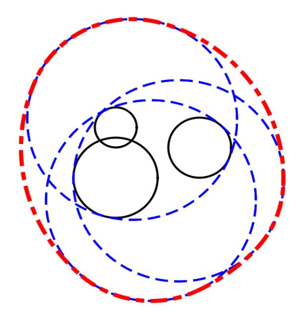
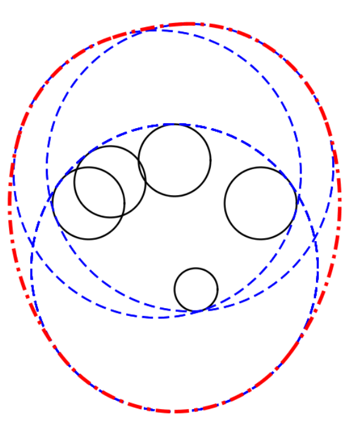

## 문제

You are given a set of circles C of a variety of radii (radiuses) placed at a variety of positions, possibly overlapping one another. Given a circle with radius r, that circle may be placed so that it encircles all of the circles in the set C if r is large enough.

There may be more than one possible position of the circle of radius r to encircle all the member circles of C. We define the region U as the union of the areas of encircling circles at all such positions. In other words, for each point in U, there exists a circle of radius r that encircles that point and all the members of C. Your task is to calculate the length of the periphery of that region U.

Figure I.1 shows an example of the set of circles C and the region U. In the figure, three circles contained in C are expressed by circles of solid circumference, some possible positions of the encircling circles are expressed by circles of dashed circumference, and the area U is expressed by a thick dashed closed curve.



Figure I.1: Example of the Circle Set

## 입력

The input is a sequence of datasets. The number of datasets is less than 100.

```

n r
x1 y1 r1
x2 y2 r2
.
.
.
xn yn rn
```

Each dataset is formatted as follows.

The first line of a dataset contains two positive integers, n and r, separated by a single space. n means the number of the circles in the set C and does not exceed 100. r means the radius of the encircling circle and does not exceed 1000.

Each of the n lines following the first line contains three integers separated by a single space. (xi, yi) means the center position of the i-th circle of the set C and ri means its radius. You may assume −500 ≤ xi ≤ 500, −500 ≤ yi ≤ 500, and 1 ≤ ri ≤ 500.

The end of the input is indicated by a line containing two zeros separated by a single space.

## 출력

For each dataset, output a line containing a decimal fraction which means the length of the periphery (circumferential length) of the region U.

The output should not contain an error greater than 0.01. You can assume that, when r changes by ϵ (|ϵ| < 0.0000001), the length of the periphery of the region U will not change more than 0.001.

If r is too small to cover all of the circles in C, output a line containing only 0.0.

No other characters should be contained in the output.

## 힌트



Figure I.2: Last Dataset of the Sample Input
