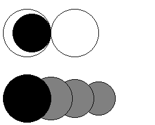

## 문제

To Mr. Solitarius, who is a famous solo play game creator, a new idea occurs like every day. His new game requires discs of various colors and sizes.

To start with, all the discs are randomly scattered around the center of a table. During the play, you can remove a pair of discs of the same color if neither of them has any discs on top of it. Note that a disc is not considered to be on top of another when they are externally tangent to each other.



Figure D-1: Seven discs on the table

For example, in Figure D-1, you can only remove the two black discs first and then their removal makes it possible to remove the two white ones. In contrast, gray ones never become removable.

You are requested to write a computer program that, for given colors, sizes, and initial placings of discs, calculates the maximum number of discs that can be removed.

## 입력

The input consists of multiple datasets, each being in the following format and representing the state of a game just after all the discs are scattered.

```

n
x1 y1 r1 c1
x2 y2 r2 c2
...
xn yn rn cn
```

The first line consists of a positive integer n representing the number of discs. The following n lines, each containing 4 integers separated by a single space, represent the colors, sizes, and initial placings of the n discs in the following manner:

* (xi, yi), ri, and ci are the xy-coordinates of the center, the radius, and the color index number, respectively, of the i-th disc, and
* whenever the i-th disc is put on top of the j-th disc, i < j must be satisfied.

You may assume that every color index number is between 1 and 4, inclusive, and at most 6 discs in a dataset are of the same color. You may also assume that the x- and y-coordinates of the center of every disc are between 0 and 100, inclusive, and the radius between 1 and 100, inclusive.

The end of the input is indicated by a single zero.

## 출력

For each dataset, print a line containing an integer indicating the maximum number of discs that can be removed.
