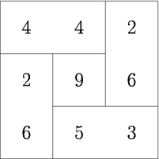

## 문제

Faced with seriously tight power supply-demand balance, the electric power company for which you are working implemented rolling blackouts in this spring. It divided the servicing area into several groups of towns, and divided a day into several blackout periods. At each blackout period of a day, one of the groups, which alternates from one group to another, is cut off the electricity. By keeping the total demand of electricity used by the rest of the towns within the supply capacity, the company avoided unforeseeable large-scale blackout.

Working at the customer relations department, you had to listen to so many complaints from the customers, which made you think that you could have a better implementation. Most of the complaints are about the frequent cut-offs. But you could have divided the area into a larger number of groups, which resulted in less frequent cut-offs for each group. The other complaints are about the complicated grouping (in fact, someone said that the shapes of the groups are fractals), which makes it impossible to understand which town belongs to which group without closely inspecting into the grouping list publicized by the company. With the rectangular servicing area and towns located in a grid form, you could have made a simpler grouping.

When you talked your analysis directly to the president of the company, you are appointed to plan rolling blackouts for this summer. Be careful what you propose. Anyway, you need to divide the servicing area into as many groups as possible with keeping total demand of electricity within the supply capacity. It should also divide the towns into simple and easy to remember groups.

Your task is to write a program, given a demand table (a table showing electricity demand of each town) and the supply capacity, that answers a grouping of towns that satisfy the following conditions.

1. The grouping should be made by horizontally or vertically splitting the area in a recursive manner. In other words, the grouping must be a set of areas after applied the following splitting procedure to a set containing only the entire area for zero or more times:  
   (The splitting procedure) remove one area from the set, either vertically or horizontally split it into two sub-areas, and put the sub-areas into the set.
2. The maximum suppressed demand of the grouping, which is the greatest total demand of the all but one group, is no more than the supply capacity.
3. The grouping has the largest number of groups among the groupings that satisfy the above conditions 1 and 2.
4. The grouping has the greatest amount of reserve power among the groupings that satisfy the above conditions 1, 2 and 3, where the reserve power of a grouping is the difference between the supply capacity and the maximum suppressed demand.

Note that the condition 1 does not allow such a grouping shown in Figure E-1.



Figure E-1: A grouping that violates the condition 1

## 입력

The input consists of one or more datasets. Each dataset is given in the following format.

```

h w s 
u11 u12 ... u1w
u21 u22 ... u2w
... 
uh1 uh2 ... uhw
```

The first line contains three positive integer numbers, namely h, w and s, denoting the height and width of the demand table and the power supply capacity. The following h lines, each of which contains w integer numbers, denote demands of towns at respective locations. Those figures are constrained as follows.

* 1 ≤ h, w ≤ 32
* 1 ≤ uij ≤ 100

Regrettably, you may assume that the supply capacity is less than the total demand of the area.

The last dataset is followed by a line containing three zeros.

## 출력

For each dataset, print a line having two integers indicating the number of groups in the grouping that satisfies the conditions, and the amount of the reserve power. Each line should not have any character other than those numbers and a space in between.
