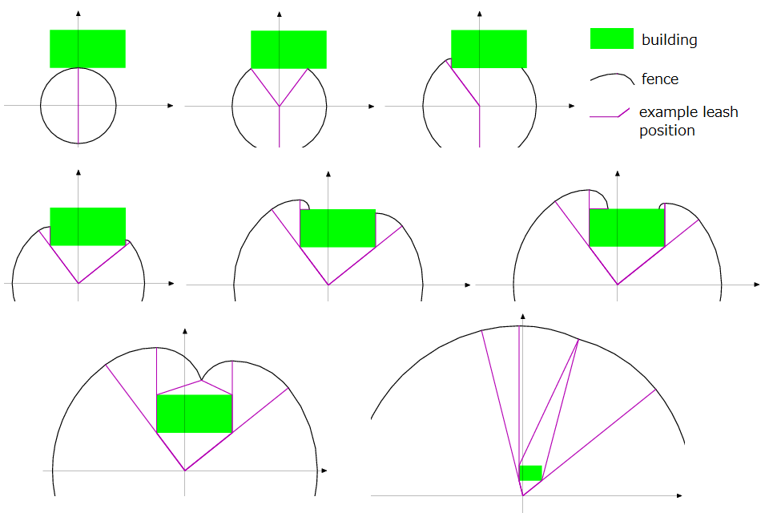

## 문제

In Northern Kyushu, you are running a company which rents watchdogs in response to the customers' order. The distinguishing point of your service is that you also install fences to enhance the performance of watchdogs.

The dog is put on a leash, which is tied up to a peg. You are installing fences at the border of the dog's reach, so that strangers approaching the fence are taken care of by your dog.

There may be a rectangular building near the dog; the dog cannot enter the building, but can go around it as long as the length of the leash permits, as in Figure F-1. You do not need fences along the building's wall.



Figure F-1: Example fence layouts (some parts of the fences are omitted.)

Given the length of the leash and the position and the size of the building, your program should calculate the length of the fence.

## 입력

The input consists of multiple datasets each consisting of five integers in a line of the following format.

```

len x1 y1 x2 y2
```

len indicates the length of the leash. x1, y1, x2 and y2 indicate the size and position of the building in that a point with coordinate (x,y) such that x1 < x <x2 and y1 < y < y2 is contained in the building. This means that the building's walls are parallel to either the X-axis or Y-axis. The peg is located on the origin.

You may assume that 0 < len ≤ 100, −100 ≤ x1 < x2 ≤ 100 and −100 ≤ y1 < y2 ≤ 100. You may also assume that the peg is located apart from the building (that is, neither inside nor on the border of the building).

The end of the input is indicated by a line containing five zeros.

## 출력

For each dataset, output the total length of the fences as a single fractional number in a line. There may not be any other characters in the output. The output should not contain an error greater than 0.00001.
