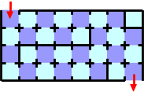
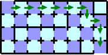
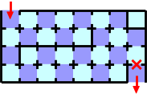
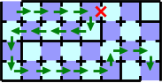
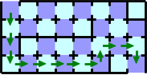
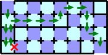

## 문제

There is a rectangular maze consisting of a number of square rooms arranged in grid. The maze is surrounded by walls except for its entry and exit. The entry to the maze is at the leftmost part of the upper side of the rectangular area, that is, the upper side of the uppermost leftmost room of the maze is open. The exit is located at the rightmost part of the lower side, likewise.

There is a wall between each pair of vertically or horizontally adjacent rooms. Such a wall has either a door with a card key lock, or no door at all. If you insert a card to a door, the door opens and you can pass the door. The opened door will close immediately, and the inserted card won't return. You can open any door with any card. You cannot go through a wall that has no door.

When a maze map is given, you can easily determine how many cards are needed to pass through the maze from the entry to the exit. In the maze in Figure G-1, you can pass through it with ten cards, following the path represented by the green arrows () in Figure G-2.

Figure G-1: A map of a maze

Figure G-2: One of the shortest paths

Now, you are informed that one of the doors is broken and can't be passed. But you don't know which door is broken. If you insert a card to a broken door, the inserted card immediately returns. However, you can't tell a broken door from a working door just by its appearance.

Figure G-3: A maze that potentially can't be passed through

If the door marked with a red X () in Figure G-3 is broken, you have no way to pass through the maze from the entry to the exit. However, you can pass the maze in Figure G-1 whichever door is broken. When you intend to follow the shortest path in Figure G-2, and find that the door marked with a red X in Figure G-4 is broken, you might follow the path represented as green arrows. In this case, you need twenty cards.

Figure G-4: A maze with a broken door

However, you can pass through the maze with less cards. You should follow the path in Figure G-5, until you find the broken door. The path is not the shortest path because it needs twelve cards at least. After you've found a broken door on the path, you should follow the shortest path to the exit that doesn't use the broken door. With this strategy, you can pass the maze with sixteen cards whichever door is broken. Figure G-6 shows one of the worst cases of this strategy; it needs sixteen cards.

Figure G-5: The path before you find the broken door

Figure G-6: One of the worst cases of the strategy

You are requested to write a program that prints the minimum number of cards to pass the maze whichever door is broken.

## 입력

The input consists of one or more datasets, each of which represents a maze. The number of datasets is no more than 100.

The first line of a dataset contains two integer numbers, the height h and the width w of the rectangular maze, in this order. You may assume that 2 ≤ h, w ≤ 30. The following 2 × h − 1 lines of a dataset describe whether there are doors between rooms or not. The first line starts with a space and the rest of the line contains w − 1 integers, 1 or 0, separated by a space. These indicate whether doors connect horizontally adjoining rooms in the first row. An integer 0 indicates a door is placed, and 1 indicates no door is there. The second line starts without a space and contains w integers, 1 or 0, separated by a space. These indicate whether doors connect vertically adjoining rooms in the first and the second rows. An integer 0/1 indicates a door is placed or not. The following lines indicate placing of doors between horizontally and vertically adjoining rooms, alternately, in the same manner.

The end of the input is indicated by a line containing two zeros.

## 출력

For each dataset, output a line having an integer indicating the minimum number of cards needed. If there exists no path to pass through the maze when a certain door is broken, output a line containing −1. The line should not contain any character other than this number.
