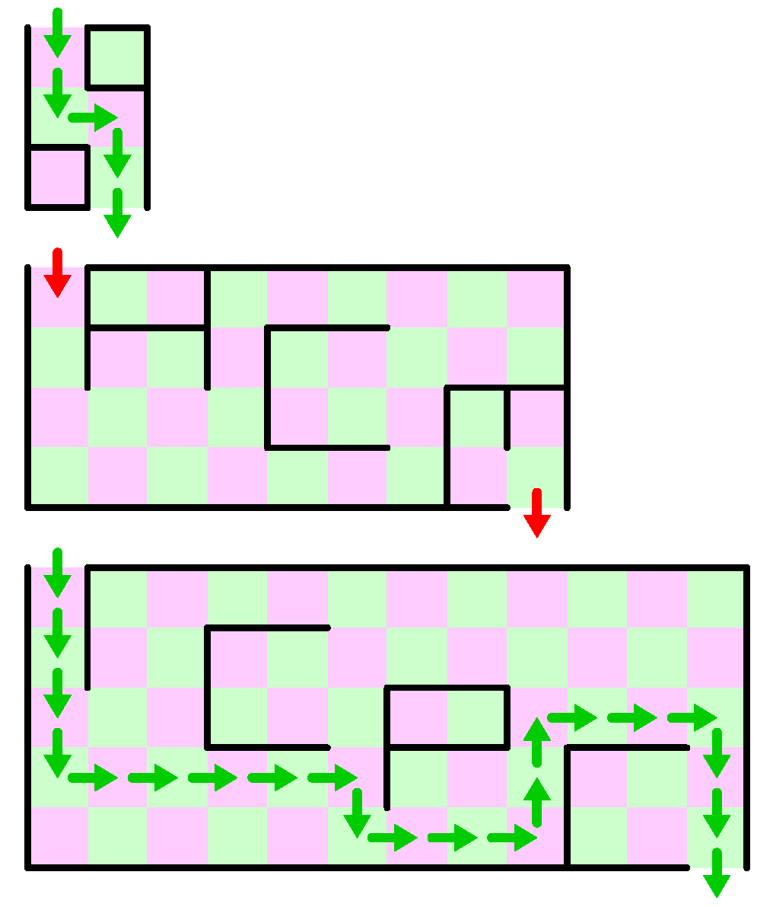

## 문제

You are requested to solve maze problems. Without passing through these mazes, you might not be able to pass through the domestic contest!

A maze here is a rectangular area of a number of squares, lined up both lengthwise and widthwise, The area is surrounded by walls except for its entry and exit. The entry to the maze is at the leftmost part of the upper side of the rectangular area, that is, the upper side of the uppermost leftmost square of the maze is open. The exit is located at the rightmost part of the lower side, likewise.

In the maze, you can move from a square to one of the squares adjoining either horizontally or vertically. Adjoining squares, however, may be separated by a wall, and when they are, you cannot go through the wall.

Your task is to find the length of the shortest path from the entry to the exit. Note that there may be more than one shortest paths, or there may be none.

## 입력

The input consists of one or more datasets, each of which represents a maze.

The first line of a dataset contains two integer numbers, the width w and the height h of the rectangular area, in this order.

The following 2 × h − 1 lines of a dataset describe whether there are walls between squares or not. The first line starts with a space and the rest of the line contains w − 1 integers, 1 or 0, separated by a space. These indicate whether walls separate horizontally adjoining squares in the first row. An integer 1 indicates a wall is placed, and 0 indicates no wall is there. The second line starts without a space and contains w integers, 1 or 0, separated by a space. These indicate whether walls separate vertically adjoining squares in the first and the second rows. An integer 1/0 indicates a wall is placed or not. The following lines indicate placing of walls between horizontally and vertically adjoining squares, alternately, in the same manner.

The end of the input is indicated by a line containing two zeros.

The number of datasets is no more than 100. Both the widths and the heights of rectangular areas are no less than 2 and no more than 30.

## 출력

For each dataset, output a line having an integer indicating the length of the shortest path from the entry to the exit. The length of a path is given by the number of visited squares. If there exists no path to go through the maze, output a line containing a single zero. The line should not contain any character other than this number.

## 힌트

