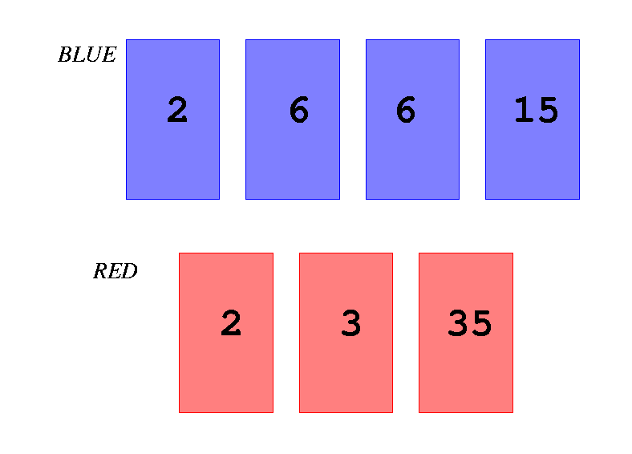

## 문제

There are many blue cards and red cards on the table. For each card, an integer number greater than 1 is printed on its face. The same number may be printed on several cards.

A blue card and a red card can be paired when both of the numbers printed on them have a common divisor greater than 1. There may be more than one red card that can be paired with one blue card. Also, there may be more than one blue card that can be paired with one red card. When a blue card and a red card are chosen and paired, these two cards are removed from the whole cards on the table.



Figure E-1: Four blue cards and three red cards

For example, in Figure E-1, there are four blue cards and three red cards. Numbers 2, 6, 6 and 15 are printed on the faces of the four blue cards, and 2, 3 and 35 are printed on those of the three red cards. Here, you can make pairs of blue cards and red cards as follows. First, the blue card with number 2 on it and the red card with 2 are paired and removed. Second, one of the two blue cards with 6 and the red card with 3 are paired and removed. Finally, the blue card with 15 and the red card with 35 are paired and removed. Thus the number of removed pairs is three.

Note that the total number of the pairs depends on the way of choosing cards to be paired. The blue card with 15 and the red card with 3 might be paired and removed at the beginning. In this case, there are only one more pair that can be removed and the total number of the removed pairs is two.

Your job is to find the largest number of pairs that can be removed from the given set of cards on the table.

## 입력

The input is a sequence of datasets. The number of the datasets is less than or equal to 100. Each dataset is formatted as follows.

```

m n 
b1 ... bk ... bm 
r1 ... rk ... rn 
```

The integers m and n are the number of blue cards and that of red cards, respectively. You may assume 1 ≤ m ≤ 500 and 1≤ n ≤ 500. bk (1 ≤ k ≤ m) and rk (1 ≤ k ≤ n) are numbers printed on the blue cards and the red cards respectively, that are integers greater than or equal to 2 and less than 10000000 (=107). The input integers are separated by a space or a newline. Each of bm and rn is followed by a newline. There are no other characters in the dataset.

The end of the input is indicated by a line containing two zeros separated by a space.

## 출력

For each dataset, output a line containing an integer that indicates the maximum of the number of the pairs.
